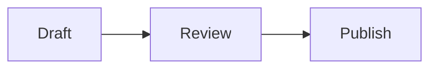

# Markdown layout cookbook

Tachyon uses Markdown structure to choose a presentation. You author the content
and its relationships; the editor measures them with the current font, text
size and window dimensions. A pattern makes a layout **eligible**, rather than
forcing a fixed number of columns.

Narrow windows, enlarged text, long content and editing can keep an eligible
group in a vertical flow. Source order remains the reading and editing order.
Automatic arrangements do not insert layout directives into saved Markdown.
These conventions are Tachyon presentations of portable content; other Markdown
readers may display the same source as ordinary headings, paragraphs and lists.

Open [the full reference](../example/reference.md) in Tachyon for larger examples
and responsive alternatives. Its numbered chapters correspond to the table below.
Image examples in this cookbook use illustrative paths: substitute your own files.

## Quick reference

| Markdown fragment or relationship | Eligible presentation | Reference chapters |
| --- | --- | --- |
| Headings, ordinary paragraphs, emphasis and hard breaks | Document hierarchy and readable prose | 01 |
| Opening property list, or labeled list under `Properties` / `Metadata` | Metadata strip or aligned properties | 02 |
| Short, independent, flat list | Balanced two-, three- or four-column list rows | 03–06 |
| Introduction ending in `:`, followed by semicolon-separated clauses | Separated inline entries when recognized | 07 |
| `- [ ]` / `- [x]` task items | Interactive checklist and completion indicator | 08 |
| Consistent `Label: value` list items | Aligned label/value rows | 09 |
| Definition terms followed by `: description` | Aligned or stacked definitions | 10 |
| Nested lists, including supporting code/tables | Hierarchical tree, compact branches when readable | 11–16 |
| Unordered items beginning with a calendar date and `:` | Horizontal or vertical timeline | 17–18 |
| Leading link followed by a description | Resource card or compact link row | 19 |
| Named `Decision:`, `Selected option:`, `Pros`, `Cons`, `Example:`, `Valid:` and `Invalid:` sections | Editorial panels and comparison pairs | 20 |
| `Metric: Name`, standalone quantity, then context | Metric panel | 21 |
| Explicit status property, or `Color: Name` with a color literal | Status badge or color swatch | 22 |
| Paragraph with adjacent alert or explicit margin note | Guidance pair or margin-note column | 23–25, 64 |
| Compatible sibling sections or substantial continuous prose | Section columns or sequential prose columns | 26–29, 62 |
| Explanation next to code, table, figure or diagram | Measured explanation/evidence pair | 30–35, 51–52, 63 |
| GFM pipe table | Aligned table, property rows or entity records | 36–39 |
| HTML table with rich cells / spans | Rich table presentation | 40–43 |
| Adjacent `Request:` and `Response:` sections containing code | Technical exchange pair | 44 |
| Fenced code with a language | Code panel, gutter and contained overflow | 45 |
| Short shell fence with an explanation | Compact command strip | 46 |
| JSON fence with a supported explicit `$schema` | Source-backed schema tree | 47 |
| `mermaid` fence | Diagram preview with editable source | 48 |
| Inline math or display math | Inline formula or display-equation block | 49 |
| Standalone image with explicit caption / credit | Captioned figure and optional prose wrap | 50–52 |
| Consecutive standalone images | Gallery rows, optionally with shared caption | 53–54 |
| Linked image whose alt text starts `Map:` | Linked map preview | 55 |
| Unavailable image | Recoverable image state | 56 |
| Blockquote, final attribution paragraph, or `Pull quote:` heading | Quote / attributed quote / pull quote | 57 |
| `[^name]` and its definition | Footnote reference, note and backlink | 58 |
| `Bibliography`, `References` or `Works cited` heading | Hanging references | 59 |
| `<details>` / `<summary>` and supported HTML | Disclosure controls or HTML preview | 60–61 |

## Foundations and lists

### Headings and prose

```markdown
# Field notes

A short introduction establishes the subject.

## 1. Reading the landscape

Use **emphasis**, a [reference](https://example.org), and `literal_code`.

These soft source lines
can reflow as one paragraph.
```

Heading levels establish hierarchy and outline entries. Authored numbering such
as `1.` or `1.1` can receive a compact badge. Two trailing spaces before a
newline retain a hard line break; ordinary source newlines reflow.

### Feature grids, steps and checklists

```markdown
- **Readable:** Keep the idea clear.
- **Local:** Keep your files nearby.
- **Portable:** Save ordinary Markdown.
- **Editable:** Work directly in the document.
```

Flat, independent lists with 2–12 short items can form balanced grid rows.
Measured wrapping, available height and width determine the column count.
Long, uneven or nested items use a vertical or hierarchical presentation.

Ordered items that describe actions or explicitly refer to earlier/later steps
retain sequential treatment. Independent numbered facts can qualify for a grid.
Do not use an ordered list merely to request columns.

```markdown
1. Open the document.
2. Review the changes from step 1.
3. Save the result.

- [x] Draft the introduction
- [ ] Review the examples
- [ ] Publish the document
```

Task syntax supplies real checked/unchecked state and progress. Nest tasks by
indentation to preserve their ownership. Checklist arrangement and spacing are
being refined; check the current build rather than relying on a fixed grid or
pixel gap. Task syntax is not a general-purpose card selector.

An introduction ending in a colon followed by 2–12 semicolon-separated clauses
can also form an inline enumeration within a paragraph:

```markdown
We need: (1) clear ownership; (2) readable structure; (3) reliable recovery.
```

### Label rows, metadata and definitions

```markdown
## Properties

- **Owner:** Editorial team
- **Status:** In review
- **Version:** 2.1
```

`Metadata`, `Document metadata`, `Properties` and `Document properties` explicitly
establish a property section. Use at least two flat unordered label/value items.
An opening list following an H1 and up to two introduction paragraphs can also
qualify when its labels are recognized properties, such as Owner, Status,
Version, Date, License or Language. Arbitrary feature labels do not imply metadata.

Short values of fields named `Status`, `State`, `Classification` or `Maturity`
can receive badges, including in supported table fields. The literal value stays
authored: `Accepted` is not inferred from a checked box or an optimistic sentence.

Definition lists express a different relationship:

```markdown
Source
: The Markdown written by the author.

Presentation
: The arrangement chosen for the available space.

  A definition can include another paragraph or supporting content.
```

Terms share an aligned leading rail when descriptions fit beside them; larger
descriptions stack. Terms remain definition terms, not headings or outline entries.

### Trees and timelines

```markdown
- Project
  - Research
    - Interviews
    - Field notes
  - Delivery
    - Review
    - Publication
```

Indentation creates hierarchy. Compact branches may share space, while deep,
uneven or content-heavy trees retain a readable vertical structure. Indented
code, tables and other supporting blocks remain owned by their list item.

```markdown
- **2026-09-01:** Begin research
- **2026-09-08:** Review the prototype
- **2026-10-02:** Publish the findings
```

A timeline requires an unordered list of dated events; recognized dates include
years, year-month / year-month-day forms and calendar labels such as
`September 8, 2026:`. Short events can share a horizontal rail. Rich events with
additional paragraphs, nested items, code or tables remain vertical. Labels such
as `v2.0:` and `Three weeks:` are not dates. Checked items retain task semantics.

## Cards, signals and quotations

### Resource links

```markdown
- [Writing guide](https://example.org/writing): Guidance for clear documents.
- [Review guide](https://example.org/review): A checklist for reviewers.
- [Release guide](https://example.org/releases): Prepare the final package.
```

A leading link plus description establishes a resource. Recognized separators
include `: ` and a spaced dash. Short described links can form resource cards;
compact destinations can use link rows. A URL buried in ordinary prose does not
turn its paragraph into a card.

### Decisions and comparisons

```markdown
### Decision: Keep local files

Store the document beside its supporting material.

### Selected option: Markdown

Use a portable format that other editors can read.

### Pros

- Easy to share.
- Easy to version.

### Cons

- Supporting files must travel with the document.
```

These are short, named sections at heading level 2 or deeper. Recognized names
are case-insensitive and may have a title after `:`:

| Section label | Role |
| --- | --- |
| `Decision`, `Decision record` | Decision panel |
| `Selected option` | Selected alternative |
| `Pros` / `Cons` | Trade-off pair |
| `Example`, `Worked example` | Example panel, optionally with code |
| `Valid` / `Invalid` | Authored outcome pair, optionally with code |
| `Request`, `HTTP request` / `Response`, `HTTP response` | Exchange pair; each needs code |

Keep these objects short: the recognizer accepts up to three supporting blocks
and bounded content, with simple paragraphs or small flat unordered lists.
Nested subsection headings and long arguments are not isolated editorial cards.
`Decision making takes context` is not the same label as `Decision: …`.
Peers must also pass measured fit checks before appearing side by side.

### Metrics and color swatches

```markdown
### Metric: Review completion

75%

9 of 12 documents reviewed in September 2026.

### Color: Moss green

`#3F6247`

Used for emphasis and controls.
```

A metric needs `Metric: Name`, a compact standalone quantity, and one or two
context paragraphs. Tachyon does not calculate the value or invent a trend.
A number inside normal prose stays prose.

`Color`, `Colour`, `Color token` and `Colour token` identify swatches when followed
by a supported literal color value. Hex forms such as `#0aB`, `#3F6247` and
`#3f624780` retain their original spelling and alpha value in source.

### Alerts and margin notes

```markdown
> [!NOTE]
> Keep a copy of the original document.

> [!WARNING]
> Replacing a file overwrites the previous contents.
```

GFM-style `NOTE`, `TIP`, `IMPORTANT`, `WARNING` and `CAUTION` markers establish
semantic callouts. A short alert adjacent to its explanation can share a measured
row; warnings can be grouped with the action they qualify.

```markdown
The field record describes what we observed during the visit.

> Margin note: The weather changed halfway through the session.
```

`Margin note:` must begin a short blockquote immediately after a top-level
paragraph. One or two short paragraphs qualify; a heading alone is not an anchor.
Related adjacent notes can share its margin region. Narrow layouts return notes
to the normal reading flow.

### Attributed and pull quotations

```markdown
## Pull quote: Room to understand

> Give each idea room to be understood.
>
> — Editorial specimen
```

`Pull quote` or `Pull quote: Title` immediately before a paragraph-only blockquote
establishes the pull-quote role. Shortness or italics alone do not.
For ordinary or pull quotes, attribution is a separate final paragraph beginning
with `— `, `– `, `Attribution: ` or `Source: `. The blank quoted line above is
significant: it separates attribution from the passage.

## Page composition and technical content

### Prose columns and explanation pairs

Compatible sibling sections may form independent columns. Longer continuous prose
may flow through sequential columns. These arrangements depend on paragraph
length, compatible section structure, neighboring blocks and measured balance;
there is no `columns: 2` directive or special heading keyword.

Place supporting material directly beside its explanation in source:

````markdown
## Retained settings

This configuration keeps local drafts available between sessions.

```json
{"drafts": "local", "restore": true}
```
````

Code, tables, figures and diagrams can pair with an explanation before or after
them when they belong to the same context. Some compatible table/example sections
also form technical pairs. Intervening headings, semantic boundaries, excessive
height or insufficient readable width prevent a pair. These examples are document
content, not Tachyon configuration settings.

### Tables and records

```markdown
| Setting | Value |
| --- | --- |
| Storage | Local files |
| Encoding | UTF-8 |
| Recovery | Enabled |
```

GFM tables normally render as compact aligned grids. Two-column property tables
can use label/value rows. Wider tables describing independent entities may become
records, with labels alongside or above their values. Tables comparing values
across columns retain aligned comparison structure; width alone does not imply
that every table becomes cards. Long content uses wrapping or local overflow.

An optional Tachyon table comment records **authored widths**, rather than an
automatic layout choice. `null` leaves a column automatic:

```markdown
<!-- mineral-table:v1 {"border":"LogicalPixel","widths":[160,null]} -->
| Setting | Explanation |
| --- | --- |
| Storage | Keep documents in their original folder. |
```

Use supported HTML tables for structures that pipe tables cannot express, such
as `rowspan`, `colspan` or rich block content inside a cell. See reference chapters
40–43 for complete examples; not every arbitrary HTML/CSS structure is editable
as a native table.

### Code, commands and exchanges

````markdown
### Request: Create a note

```http
POST /notes HTTP/1.1
Content-Type: application/json

{"title":"Field notes"}
```

### Response: Created

```json
{"id":42,"title":"Field notes"}
```
````

Language-tagged fences supply code panels with Copy actions and syntax colors
where supported. Long lines stay inside the code area's overflow. Short shell
fences such as `sh` / `bash` with a nearby explanation can become compact command
strips. They display source; Tachyon does not execute the commands.

Named Request/Response sections require actual fenced payloads to qualify as an
exchange. An ordinary paragraph asking the reader for something is not a request
panel. The response is paired with its preceding request, preserving direction.

### JSON Schema, Mermaid and mathematics

````markdown
```json
{
  "$schema": "https://json-schema.org/draft/2020-12/schema",
  "type": "object",
  "properties": {"title": {"type": "string"}},
  "required": ["title"]
}
```



Inline mathematics: $y = mx + b$.

$$
\frac{a+b}{2}
$$
````

The JSON tree requires an explicit supported `$schema` dialect. Supported
identifiers include JSON Schema 2020-12, 2019-09, and the canonical HTTP
draft-07, draft-06 and draft-04 identifiers ending in `#`. Ordinary configuration
JSON remains code. References are retained without fetching external schemas.

Supported Mermaid syntax produces a native diagram preview. Supported math
produces inline or display formulas. Invalid, unsupported or oversized content
retains recoverable source rather than becoming a blank visual object.

## Figures and references

### Figures, wrapping and galleries

```markdown


Caption: Observations collected during the morning session.

Credit: Research team
```

A standalone image establishes a figure. Immediately following paragraphs with
`Caption:`, `Figure:`, `Photo:` or `Illustration:` establish captions; `Credit:`,
`Credits:`, `Photo credit:` and `Image credit:` establish credit. Use the spelling
and capitalization shown. Alt text and image titles do not become visible captions
automatically. A nearby explanation may sit beside a figure or wrap around a
supporting illustration when its measured dimensions leave readable text space.

```markdown


Gallery: Two observations from the same location.

Gallery credit: Research team
```

Consecutive standalone images can form gallery rows after their dimensions are
known. Each may keep its own explicit caption. `Gallery:` and `Gallery credit:`
after a group of at least two images describe the complete group. A paragraph
with that label and no adjacent image group stays ordinary prose. Images remain
complete; unavailable dimensions or narrow space keep the source-order stack.

```markdown
[](#directions)

## Directions

Enter through the courtyard.
```

A linked image with an explicit `Map:` alt label establishes a map preview.
It uses the authored image and destination; it does not fetch tiles or calculate
a route. An ordinary linked image stays an ordinary figure.

### Footnotes and bibliography

```markdown
Keep the evidence close to the claim.[^measure]

[^measure]: Measurements depend on the selected font and available width.

## Bibliography

Vale, M. (2025). *The patient page*. Example Press.

Ibarra, L. (2024). *Working notes*. [Publication](https://example.org/notes).
```

Footnote syntax creates references and corresponding note/backlink controls.
`Bibliography`, `Works cited` and `References` headings give subsequent paragraphs
or simple list entries hanging reference treatment. Numbered section prefixes
and suffixes such as `References · numbered` are recognized. A peer or ancestor
heading ends the section. Citation order and authored numbering are preserved;
Tachyon does not generate citation data from a URL.

### HTML disclosures

```html
<details>
  <summary>Supporting evidence</summary>
  <p>Additional context, shown when expanded.</p>
</details>
```

Supported `<details>` / `<summary>` fragments expose native disclosure controls.
Add `open` to `<details>` for the authored initial expanded state. Reading-time
expansion does not rewrite the attribute. Supported HTML renders through Blitz;
editing eligible HTML text can convert it to Markdown in an undoable operation.
This is not a general browser or a promise to reproduce arbitrary web pages.

## When the expected arrangement does not appear

First widen the window or reduce text zoom, finish editing the group, and allow
reflow to settle. Then check the source relationship: exact semantic label,
heading level, blank lines, list indentation, adjacent supporting blocks and
available image files. Longer text may correctly require a stack.

Compare with the corresponding chapter in [the reference](../example/reference.md)
and the smaller [layout fixtures](../performance/layout-fixtures/). Recognition
rules live in [adaptive layout](../crates/document-view/src/adaptive.rs), with
specialized recognizers for [quotes](../crates/document-view/src/quotes.rs),
[figures](../crates/document-view/src/figures.rs),
[metrics](../crates/document-view/src/metrics.rs),
[signals](../crates/document-view/src/signals.rs) and
[bibliography](../crates/document-view/src/bibliography.rs).
The [coverage ledger](../performance/DESIGN-GRAMMAR-COVERAGE.md) tracks incomplete
variants and validation; this cookbook describes implemented recognition paths,
not a claim that every combination is release-qualified.
