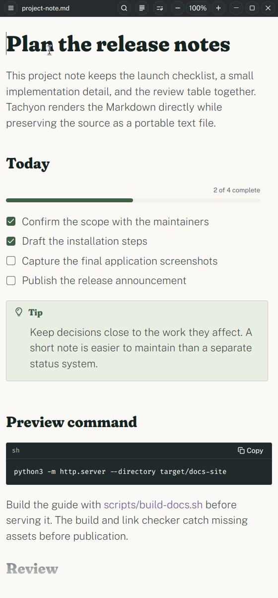
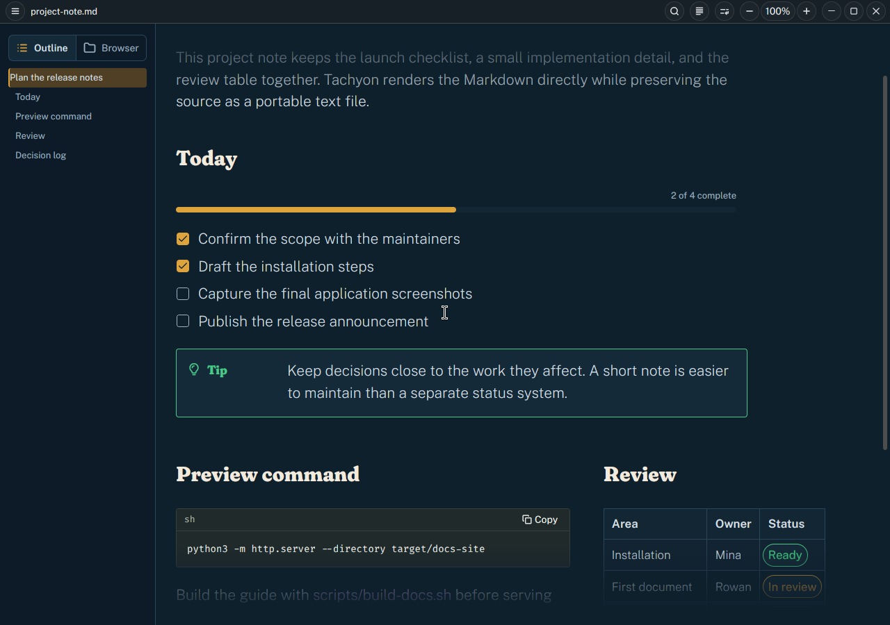

# Appearance, zoom, and accessibility

Tachyon follows the system light or dark appearance and updates an open window
when that appearance changes. Its bundled Public Sans, Fraunces, and Spline Sans
Mono typography covers the primary interface and document styles. Installed
Fontconfig fonts provide fallback for additional scripts and emoji; restart
Tachyon after installing or changing fonts so its process-local font collection
is rebuilt.

## Zoom and reflow

Use the title-bar zoom controls or these shortcuts:

- <kbd>Ctrl</kbd>+<kbd>=</kbd>: zoom in.
- <kbd>Ctrl</kbd>+<kbd>-</kbd>: zoom out.
- <kbd>Ctrl</kbd>+<kbd>0</kbd>: return to 100%.

Zoom ranges from 75% to 200%. It scales the document content and its layout
measurements. Increasing zoom can turn a multi-column layout into a
source-order stack; reducing it can make a measured arrangement eligible again.
This reflow is presentation state and does not edit the Markdown.

The title bar also provides **Justify body text** and **Hyphenation** controls.
Hyphenation detects language automatically where supported. These reading
preferences are saved with workspace state, not in the document.

## Reduced motion

Tachyon uses immediate scrolling without a release coast when reduced motion is
enabled. It first checks `TACHYON_REDUCED_MOTION`; values such as `1`, `true`,
`yes`, or `on` enable it. Without that override, disabling GTK animations through
`GTK_ENABLE_ANIMATIONS=0` also enables reduced motion.

For a one-off launch:

```sh
TACHYON_REDUCED_MOTION=1 tachyon document.md
```

With normal motion, wheel or trackpad scrolling eases out briefly after input
ends. Clicking, editing, reversing direction, or reaching an edge stops the old
motion.

## Keyboard and assistive access

Browser entries, outline entries, search, application controls, HTML disclosures,
formula overflow controls, and table-edge controls expose keyboard paths and
accessible labels. Use <kbd>Tab</kbd> and <kbd>Shift</kbd>+<kbd>Tab</kbd> to move
among controls when the caret is not using those keys for a table cell or list
item.

Supported HTML `<summary>` controls activate with <kbd>Enter</kbd> or
<kbd>Space</kbd>. Their expanded reading state is local to the view: it does not
rewrite the authored `open` attribute or enter undo history. **Restore authored
disclosures** resets those reading choices.

Document structure remains available in source order even when Tachyon displays
columns, cards, timelines, or galleries. At narrow widths and larger zoom levels,
those presentations return to a linear flow. The navigation panel also becomes
an overlay below the wide-window threshold.

[](assets/screenshots/tachyon-project-note-narrow.png)

*A real v0.1.14 capture from the same application source baseline. At 560 pixels
wide, the sidebar is hidden and the preview command stacks above the next review
section.*

[](assets/screenshots/tachyon-project-note-dark.png)

*The same baseline in dark system appearance at 100% zoom, with the Outline tab,
checklist, code, and table visible. [Capture provenance](https://github.com/mendrik-private/tachyon/blob/main/docs/user-guide/src/assets/screenshots/PROVENANCE.md).*

Native accessibility behavior varies across compositor, AT-SPI client, input
method, scale, and script combinations. If a particular preview is difficult to
operate, use its source fallback or Edit text action and report the exact desktop
environment and input path with the issue.
