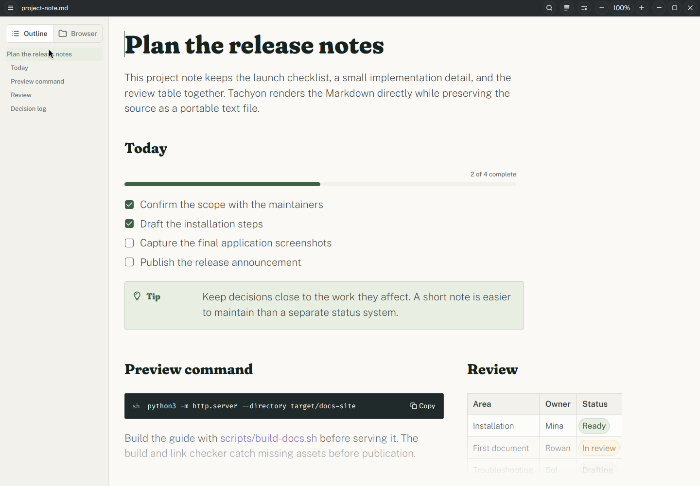

# Tachyon User Guide

Tachyon is a native Markdown editor for Linux and Wayland. You edit the rendered
document itself: headings, lists, tables, links, code, diagrams, formulas, and
supported HTML remain visible while you work. The source stays in ordinary local
Markdown files.

*A real Tachyon v0.1.14 capture from the same application source baseline as
this guide. At this width, the Outline/Browser sidebar is visible and the
preview command can sit beside the review table. Select the image for the full
capture. [Capture provenance](https://github.com/mendrik-private/tachyon/blob/main/docs/user-guide/src/assets/screenshots/PROVENANCE.md).*

Tachyon also recognizes relationships in portable Markdown and can arrange them
as grids, timelines, cards, galleries, or explanation-and-example pairs when the
window has room. These arrangements are automatic. They do not add Tachyon-only
layout directives to your document, and the same file remains readable in other
Markdown tools.

Start with [installation](install.md) and [first use](first-use.md). If you already
have Tachyon open, use the [editing guide](editing.md), browse the complete
[adaptive layout cookbook](adaptive-layouts.md), or keep the
[keyboard reference](shortcuts-and-troubleshooting.md) nearby.

## What Tachyon is designed for

- Local Markdown documents, without an account or required cloud service.
- Direct rich-text editing with source-preserving Markdown serialization.
- Technical writing with fenced code, formulas, Mermaid diagrams, and explicit
  JSON Schema trees.
- Large or structured documents with a file browser, outline, search, responsive
  reflow, autosave, and recovery.

Tachyon is a desktop editor rather than a general web browser. Supported HTML is
rendered as an inert preview; remote images and CSS resource URLs inside HTML are
denied, and arbitrary HTML or CSS may remain as editable source. Normal Markdown
HTTP(S) images use Tachyon's bounded image loader. See
[Edit Markdown](editing.md#edit-supported-html) for the conversion rules and
limitations.
