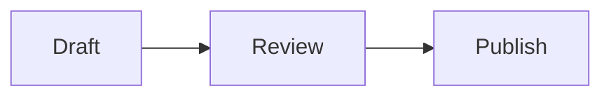

# Code, math, diagrams, and schemas

Tachyon keeps technical material editable while giving it a purpose-built
preview. Invalid or unsupported input stays recoverable as source rather than
turning into an empty visual object.

## Fenced code

Add a language after the opening fence for syntax-aware presentation and a Copy
action:

````markdown
```rust
fn main() {
    println!("Hello from Tachyon");
}
```
````

Long lines remain inside the code panel's local horizontal overflow. Short
`sh` or `bash` fences beside a brief explanation can appear as command strips.
Tachyon displays code; it does not execute commands from a document.

Named Request and Response sections can form a paired exchange when each section
contains a fenced payload:

````markdown
### Request: Read a note

```http
GET /notes/42 HTTP/1.1
```

### Response: Found

```json
{"id": 42, "title": "Field notes"}
```
````

The explicit headings and actual fences establish the relationship. Ordinary
prose using the words “request” or “response” does not.

## Mermaid diagrams

Use a `mermaid` fence:

````markdown

````

Supported syntax produces a native diagram preview. Unsupported or oversized
diagrams retain an editable source presentation. Mermaid source is not sent to a
remote rendering service.

## Mathematics

Write inline math between single dollar signs and display math between pairs:

```markdown
The slope is $m = \frac{y_2-y_1}{x_2-x_1}$.

$$
\int_0^1 x^2\,dx = \frac{1}{3}
$$
```

Display formulas retain their source-backed geometry through theme changes and
cache eviction. Editing the source refreshes the preview. Invalid formulas keep
an editable source fallback. When a formula is wider than its viewport, focus
its overflow control: Left and Right pan, Home and End move to either edge,
Enter edits the source, and Escape returns to the document.

## JSON Schema trees

A JSON fence becomes a schema tree only when it contains an explicit supported
`$schema` identifier:

````markdown
```json
{
  "$schema": "https://json-schema.org/draft/2020-12/schema",
  "type": "object",
  "properties": {
    "title": {"type": "string"}
  },
  "required": ["title"]
}
```
````

Supported dialects include JSON Schema 2020-12, 2019-09, and the canonical HTTP
draft-07, draft-06, and draft-04 identifiers ending in `#`. Ordinary JSON remains
a code block. References are preserved but Tachyon does not fetch external
schemas.

For layouts that pair explanations with these objects, see
[Page composition and technical content](adaptive-layouts.md#page-composition-and-technical-content).
