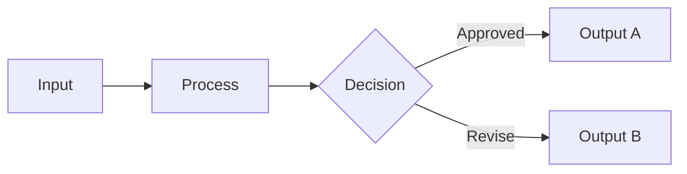
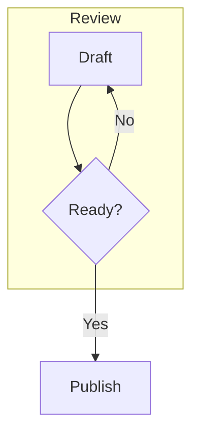
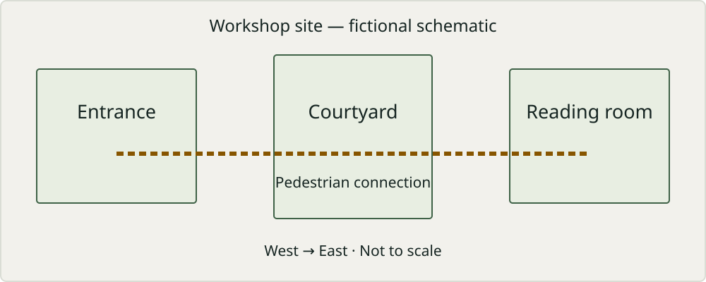

# Mineral layout reference

This is one working document for exploring Mineral’s implemented layout families. Read it wide, narrow, and with enlarged text: the same Markdown can become an open list, a measured row, a readable pair, a compact record, or a vertical stack without losing its source order.

The opening itself is a lead-and-overview specimen. The catalogue brings together typography, structured lists, editorial cards, prose columns, technical evidence, images, quotations, and supporting notes. Use the document outline to move between the numbered chapters. The examples retain the structures used by the existing layout fixtures rather than introducing a separate layout language.

## How to use this reference

- Begin with a wide window at 100% text size. Narrow it or increase text size to compare the alternatives.
- Layout is automatic and content-dependent. Short windows, active editing, intrinsic image sizes, and neighboring sections can change which arrangement wins; a wide window does not force every block into columns.
- All numbered chapters are specimens. Names, dates, completion states, metrics, citations, API payloads, and configuration values are illustrative—not current project status, real research citations, or a promise that sample settings are supported application configuration.
- Code is example text, not an instruction to execute commands. Example-domain links are placeholders. Local images are reused from this repository; keep this file in `example/` so its relative paths resolve.
- Missing images, incomplete math, and incomplete diagrams are intentional recovery examples. Ordinary content and long-list fallbacks are included alongside transformed layouts.
- This is a reference for implemented paths, including partially verified families—not a release qualification. Audio/video playback, paginated page masters, running headers/footers, and print/export layouts are not implemented specimens here.

## Jump to a family

<!-- mineral-table:v1 {"border":"LogicalPixel","widths":[null,509.1892395019531]} -->
| Family | Start here |
| --- | --- |
| Lists and relationships | [Features numbered grids steps and tasks](#03-features-numbered-grids-steps-and-tasks) · [Deep trees with readable context](#11-deep-trees-with-readable-context) · [Horizontal and vertical timelines](#17-horizontal-and-vertical-timelines) |
| Cards and guidance | [Resource cards and compact links](#19-resource-cards-and-compact-links) · [Metrics with context](#21-metrics-with-context) · [Warnings attached to actions](#25-warnings-attached-to-actions) |
| Page composition | [Independent section columns](#26-independent-section-columns) · [Continuous prose columns](#28-continuous-prose-columns) · [Table\-first explanation](#32-table-first-explanation) |
| Tables and records | [Specification example and compact table tracks](#35-specification-example-and-compact-table-tracks) · [Entity tables records and technical partitions](#37-entity-tables-records-and-technical-partitions) · [Rich table cells and nested containers](#40-rich-table-cells-and-nested-containers) |
| Technical content | [Request and response pairs](#44-request-and-response-pairs) · [JSON Schema trees](#47-json-schema-trees) · [Inline display and wide mathematics](#49-inline-display-and-wide-mathematics) |
| Figures and galleries | [Captioned figures and true text wrap](#50-captioned-figures-and-true-text-wrap) · [Multi\-image galleries](#53-multi-image-galleries) · [Linked map previews](#55-linked-map-previews) |
| References and rich text | [Attributed nested and pull quotations](#57-attributed-nested-and-pull-quotations) · [Footnotes and backlinks](#58-footnotes-and-backlinks) · [Open closed and nested disclosures](#60-open-closed-and-nested-disclosures) |

---

# 01. Typography and reading

These field notes explore how a document can feel composed while remaining ordinary Markdown. Clear hierarchy, a comfortable reading measure, and a little space make room for the ideas.

## Reading and rhythm

A good reading surface supports attention. The title establishes the subject, the introduction offers a way in, and section headings let the reader return to a thought without retracing the entire argument. Longer paragraphs should occupy a comfortable column even on a wide display.

**Clarity begins with structure.** Emphasis can add contrast without competing with the heading. A [useful reference](https://github.github.com/gfm/) stays recognizable as a link, while `layout_width` belongs to the language of code. A ~~discarded phrase~~ should remain readable.

> The most useful arrangement is the one that makes the relationship between ideas easy to see.

### A note on line breaks

The garden at dawn  
The rain on the window  
A page waiting to be written

Soft lines in an ordinary paragraph
can reflow as the window changes,
while those three deliberate hard breaks remain.

## Details worth keeping

> [!NOTE]
> A presentation choice belongs to the workspace. The saved document remains portable Markdown.

> [!TIP]
> Widen the window to compare automatic arrangements, or increase text size to return the same content to a readable stack.

---

### Languages and inline detail

Helsinki, naïve, 日本語, العربية, and 👨‍👩‍👧‍👦 should remain intact through selection, copying, and editing. A long identifier such as `document_layout_preferences_for_current_workspace` should wrap sensibly.

#### A smaller heading

The shared leading edge carries the document through all six heading levels.

##### A fine distinction

Reference definitions and comments retain their authored meaning.[^ref-01-measure]

###### Closing observation

Typography provides the hierarchy; additional decoration is optional.

[^ref-01-measure]: A readable measure depends on the chosen font, size, and available width.

---

# 02. Metadata strips and aligned properties

Essential document properties belong together, without competing with the title or the reading surface.

- **Status:** In review
- **Version:** `2.1`
- **Owner:** Editorial team

## Properties

- **Source:** Local Markdown files, preserved byte-for-byte outside the edited region.
- **Review scope:** Typography, relationships, spacing, accessibility, and source-preserving editing across the complete document.
- **Distribution:** A continuously editable reference document, with all supporting context kept visible.

## Ordinary features remain ordinary

- **Readable:** Use a comfortable measure.
- **Stable:** Keep source order intact.
- **Editable:** Preserve every authored word.

## Document metadata

- Language: English
- License: MIT
- Updated: 2026-09-08

## Afterwards

Metadata is descriptive, not an approval or completion state. A label such as “In review” never receives a fabricated checkmark.

---

# 03. Features numbered grids steps and tasks

Six independent qualities can share a grid. Instructions follow a number rail, tasks keep their state, and nested ideas retain their hierarchy.

## Six principles

1. **Clarity:** Make the main idea easy to find.
2. **Continuity:** Keep the reader's place intact.
3. **Balance:** Give related ideas similar weight.
4. **Restraint:** Use decoration with a purpose.
5. **Fidelity:** Preserve the author's structure.
6. **Comfort:** Leave enough room for each thought.

## Everyday features

- **Markdown first:** Plain text stays portable.
- **Local documents:** Your files live beside your work.
- **Adaptive layouts:** Arrangements respond to available space.
- **Readable type:** Clear headings and generous leading.
- **Stable editing:** Selection follows the original content.
- **Native controls:** Familiar shortcuts remain within reach.

## Getting started

1. Open a folder containing your project notes.
2. Create a document and give it a descriptive title.
3. Add the ideas you want to explain to your reader.
4. Review the automatic arrangement at a narrow width.

## Before sharing

- [x] Establish the main idea
- [x] Check heading hierarchy
- [x] Review the examples
- [ ] Incorporate comments
- [ ] Read the document at a narrow width
- [ ] Publish the final version

## A nested outline

1. Project overview
   - Audience
   - Success criteria
2. Content strategy
   - Key messages
   - Structure
     - Draft outline
     - Review notes
3. Next steps
   - Launch plan
   - Ongoing maintenance

## Uneven items stay vertical

- A short observation.
- This longer observation needs substantially more room. It explains why a grid can waste space when a single item contains an extended argument, several qualifications, and a conclusion that depends on reading the whole paragraph carefully. Preserving a spacious vertical flow is the right decision for this content.
- Another brief thought.

---

# 04. Short lists with two to twelve items

Independent ideas can share space while preserving their order. A collection should not become a long vertical list simply because it contains two or ten entries.

## Two complementary views

- **Reading view:** A quiet surface for following an argument and reviewing the complete document.
- **Reference view:** Compact components for comparing details and finding the information needed for a task.

## Ten kinds of material

- Field notes from an observation.
- Interview notes from a conversation.
- Research notes with source references.
- Meeting notes with agreed outcomes.
- Design notes explaining a choice.
- Project notes recording progress.
- Reading notes on a published work.
- Travel notes describing a place.
- Workshop notes collecting ideas.
- Review notes identifying changes.

## Twelve useful collections

- A collection of short essays.
- A collection of field reports.
- A collection of project briefs.
- A collection of design sketches.
- A collection of technical examples.
- A collection of meeting records.
- A collection of research sources.
- A collection of interview excerpts.
- A collection of workshop findings.
- A collection of reading summaries.
- A collection of progress reports.
- A collection of review decisions.

## A single point

- One independent point remains an ordinary list item.

---

# 05. Balanced list rows

Independent observations can share the page without leaving a lonely final item. Read each row from left to right, then continue below.

## Five ways to gather context

- Read the project overview.
- Review the current design.
- Explore an example document.
- Compare the recorded decisions.
- Talk through an open question.

## Seven useful perspectives

- An observation from the field.
- An account from an interview.
- A finding from published work.
- A sketch of a possible approach.
- A note from a project review.
- A question for further research.
- A decision with its explanation.

## Keep dependent work in order

1. Read the original proposal.
2. Using the result of step 1, identify the assumptions.
3. Review the assumptions with the author.
4. Incorporate the agreed changes.
5. Publish the revised proposal.

---

# 06. Four-column features

Short independent entries can share a wide page. Longer explanations still need room to breathe, and reading order always follows the source.

## Four working materials

- Field notes
- Reading notes
- Design sketches
- Review decisions

## Eight perspectives

- Observation
- Conversation
- Published research
- Direct experience
- Recorded evidence
- Design intent
- Open questions
- Practical constraints

## Twelve collections

- Short essays
- Field reports
- Project briefs
- Design sketches
- Technical examples
- Meeting records
- Research sources
- Interview excerpts
- Workshop findings
- Reading summaries
- Progress reports
- Review decisions

## Longer explanations

- Field notes preserve details from direct observation and retain the context that makes those details useful to a later reader.
- Reading notes connect an argument to its published source and record how the evidence supports the conclusion.
- Design notes explain the alternatives considered and the reasons for the chosen approach, including unresolved questions.
- Review notes identify changes that need attention and preserve enough background for a colleague to act on them.

---

# 07. Inline enumerations

An authored introduction connects the following clauses. Their punctuation and formatting remain part of one editable paragraph, wherever the clauses are displayed.

## Evidence stays connected

Keep evidence together: (a) field notes record direct observations and the context that makes them useful; (b) reading notes connect an argument to its published source and supporting evidence; (c) review notes identify decisions, unresolved questions and the reasons for a change.

## Compare the options

Consider the available forms: **Local files:** keep the original material on your own disk; **Shared folder:** exchange a working copy with colleagues; **Published copy:** prepare a stable version for readers.

## Preserve literal punctuation

Keep examples literal: `left;right` is a single code example; [A; B](https://example.test/reference) is one link label; the final clause retains its own words.

## Ordinary prose stays prose

Read carefully: these ideas belong in an ordinary sentence, with the qualifiers and connections that give the argument its meaning, rather than a collection of extracted phrases.

One clause introduces a question; another explores its implications. Without an explicit introductory structure, the sentence remains continuous prose.

---

# 08. Checklist strips and nested progress

Short tasks share a compact band. Each checkbox still belongs to its authored task, and longer work keeps the space it needs.

## Before sharing

- [x] Sources checked
- [ ] Links reviewed
- [ ] Examples tested
- [x] Names verified
- [ ] Figures checked
- [ ] Notes saved

The checklist records actual completion, not an inferred assessment of quality. Its reading order stays the same when the window changes.

## Detailed work

- [ ] Read the complete explanation and confirm that every supporting example remains attached to the claim it explains.
- [x] Keep the original working notes and unresolved questions available so that another reader can follow the reasoning.

## Nested responsibilities

- [x] Document review
  - [x] Read the source notes
  - [x] Review the references
- [x] Final handoff
  - [x] Share with the editor
  - [ ] Retain the working copy

---

# 09. Aligned labels and outlines

A reference document uses alignment to explain relationships. Terms share a common column; hierarchy keeps its original order.

## A compact vocabulary

- **Source:** The original Markdown remains authoritative and unchanged by presentation.
- **Presentation:** Typography, spacing and placement are derived from content and available space.

## Working vocabulary

- **Document:** A sequence of authored blocks with stable identities.
- **Paragraph:** A continuous thought, with inline emphasis and links.
- **Heading:** A named boundary that establishes section hierarchy.
- **List:** Related items whose order and completion semantics remain intact.
- **Table:** Values connected to explicit row and column headers.
- **Figure:** An image kept whole when it carries evidence.
- **Quotation:** Another voice, retained with its authored attribution.
- **Callout:** A contextual instruction with a meaningful label and icon.
- **Selection:** A source range that stays editable through every reflow.
- **Layout:** A measured arrangement, separate from the saved document.

## Project structure

- **Research**
  - Questions and assumptions
  - Evidence collection
    - Interviews
    - Source documents
- **Delivery**

  4. Prepare the candidate
  5. Review the result
     - Check the structure
     - Inspect the details
       - Text and borders
       - Focus and selection
  6. Record the outcome
- **Maintenance**
  - Follow-up work
  - Regression coverage

## A deliberate boundary

Guides end with their own subtree. This paragraph is not part of the hierarchy above it.

---

# 10. Definition lists and rich descriptions

Terms and their explanations form an open glossary. The labels share a measured rail; rich descriptions keep their original reading order and stack when space tightens.

## Layout vocabulary

Canvas
: The available document surface after navigation and outer margins have been reserved.

Reading measure
: A comfortable text width, measured with the loaded typeface rather than estimated from a fixed character count.

Stable identity
: The source-owned identity of a block. **Changing its placement does not change its content.**
: Selection, links and undo continue to address that same block.

## Rich descriptions

Prepared geometry
: Text is shaped before the reader scrolls. A description can contain supporting paragraphs and a code example.

    ```rust
    let width = canvas.available_width();
    let rows = grammar.measure(document, width);
    ```

    The code retains its whitespace, language label and Copy action.

Relationships
: Preserve the meaning of each group:

    - Terms name concepts.
    - Descriptions explain them.
    - Layout never invents a rank or completion state.

## Labels that need room

A deliberately long term that should not squeeze its description into a narrow corridor
: This definition stacks beneath its label at the full reading measure. All text remains visible and editable.

---

# 11. Deep trees with readable context

A deep outline should retain its relationships without squeezing the last item into an unreadable column. The labels below remain ordinary editable Markdown.

## Field study

- Coastal survey
  - Spring season
    - Northern region
      - Research team
        - Morning visit
          - Harbour station
            - Water sample
              - Temperature reading
                - Digital instrument
                  - Calibration record
                    - Reference measurement
                      - Review the recorded value and retain the conditions under which it was collected. Even this twelfth level needs room for its evidence, explanation and qualifications.
                    - Keep the comparison with the original reference measurement.
              - Preserve the accompanying observation.
      - Schedule the next visit.

## Review checks

- [x] Source retained
  - [x] Context recorded
    - [ ] Evidence reviewed
      - [ ] Confirm the recorded value against the reference before approving the result.

## Continue

The next section returns to the ordinary reading column. Presentation changes neither the hierarchy nor the contents of the file.

---

# 12. Trees with code tables and figures

Supporting material belongs with the instruction it explains. A narrow window should keep code, tables, figures and quotations attached to their original branch.

## Survey record

- Coastal survey
  - Spring season
    - Northern region
      - Research team
        - Morning visit
          - Harbour station
            - Water sample
              - Review the reading and its supporting evidence.

                ```rust
                let reading = 18.4;
                let unit = "celsius";
                record(reading, unit);
                ```

                | Reading | Recorded | Reference |
                | --- | ---: | ---: |
                | Temperature | 18.4 | 18.5 |
                | Salinity | 32.1 | 32.0 |

                > Retain the original observation and the conditions under which it was collected. A later review needs both the measurement and its context.

                

                Keep this explanation with the code, comparison and figure above. None of the supporting material changes the order of the survey record.
              - Record the remaining question before leaving this branch.
      - Schedule the next visit.

## Continue

The next section returns to the ordinary reading column. All supporting material remains in the same Markdown file.

---

# 13. Trees inside quotes and callouts

An outline can belong to a quotation or a callout. Its enclosing context should remain visible without consuming the width needed to read its deepest branches.

## Quoted field notes

> - Expedition
>   - Coastal region
>     - Harbour visit
>       - Morning survey
>         - Water station
>           - Sample record
>             - Instrument check
>               - Quoted evidence keeps the original measurement, its conditions and the remaining questions together. Read the complete explanation before drawing a conclusion.
>             - Retain the comparison with the previous observation.
>   - Return to the expedition summary.

## Review before publishing

> [!NOTE]
> - Publication
>   - Review cycle
>     - Draft report
>       - Methods section
>         - Supporting material
>           - Source record
>             - Editorial check
>               - Enclosed guidance keeps each qualification attached to the claim it supports. Verify the original record and retain any uncertainty in the published explanation.
>             - Record the unresolved editorial question.
>   - Return to the publication summary.

## Continue reading

The next section returns to the ordinary document flow. Neither enclosure changes the source hierarchy or the order in which the reader encounters its evidence.

---

# 14. Code heading and image-led branches

An item does not need an invented paragraph title. Keep its authored code, heading or figure as the beginning of the branch, with supporting explanations below it.

## Source-led outline

- Archive
  - Coastal survey
    - Instrument record
      - ```rust
        let sample = 18.4;
        inspect(sample);
        ```
        - Interpretation
          - Review notes
            - ### Evidence heading
              - ```rust
                let accepted = true;
                record(accepted);
                ```
                - Code-led explanation preserves the measurement and the reasoning behind the decision. Keep the remaining questions with the original source, even when this branch is viewed in a narrow window.
              - 
                - Figure-led explanation describes the layers without substituting a generated title for the authored image description.
          - Return to the interpretation summary.
  - Return to the archive summary.

## Continue

The next section keeps its ordinary document position. The source still contains the same code blocks, heading, image and nested list items.

---

# 15. Quote callout and table-led branches

A branch may begin with a quotation, a note or a table. Its supporting explanation belongs to that evidence, without requiring an invented paragraph title.

## Field record

- Archive
  - Coastal survey
    - Instrument records
      - Morning observations
        - Review packet
          - Original evidence
            - > The observer recorded a steady temperature before the wind changed.
              - Quoted evidence keeps the observation and its interpretation together. A narrow window should leave enough room to read this explanation without squeezing it into a vertical strip.
            - > [!NOTE]
              > Keep the original readings beside the calibration record.
              - Note-led explanation retains the uncertainty and the next verification step. The note remains a note, and its child remains part of the same source hierarchy.
            - | Reading | Value |
              | --- | --- |
              | Temperature | 18.4 °C |
              | Wind speed | 3.2 m/s |
              - Table-led explanation relates the measured values to the surrounding conditions. Headers and values remain a real table with their original row and column relationships.
          - Return to the review packet.
  - Return to the archive.

## Continue

The following section returns to the ordinary document measure. All quotations, notes, table cells and explanations remain in their authored order.

---

# 16. Empty and unlabeled branches

An empty introduction still owns its children. Keep its marker visible and leave enough room for the explanation.

## Field outline

+ Archive
  + Coastal survey
    + Instrument records
      + Morning observations
        + Review packet

          +
            +
              + Unlabeled branches retain their own place. This explanation should use the available reading width without borrowing its words to name either blank parent.
              + A second observation belongs beside the first, not inside an invented heading.
            + Return to the first blank parent.

          +
          + Return to the review packet.
  + Return to the archive.

## Continue

The following section keeps the ordinary document measure. Blank markers are real source items, not missing content or loading placeholders.

---

# 17. Horizontal and vertical timelines

An event keeps its date, its full explanation, and its place in the original sequence. The arrangement follows the space available.

## Four milestones

- **2022:** Initial research
- **2023:** Prototype and testing
- **2024:** Public release
- **2025:** Continued improvement

## A detailed release history

- **2026-09-08:** Reviewed the source-preserving editing model with a long technical document. The review covered keyboard selection, undo, tables, and the relationship between visible content and original Markdown.
- **2026-09-05:** Tested the first complete layout grammar against narrow windows. Kept dates and descriptions together, and checked that text returns to a readable single column when there is not enough room for a horizontal sequence.
- **2026-08-28:** Collected the initial editorial references. The team recorded which visual treatments express an actual relationship and which merely add decoration, preserving those distinctions in the written design grammar.

## Calendar labels

- September 8, 2026: Design review
- October 2, 2026: Accessibility review

## These are not dates

- **v2.0:** A software version remains a label.
- **Three weeks:** A duration is not a calendar date.

## Tasks retain their meaning

- [x] 2026-09-08: Record the review notes.
- [ ] 2026-10-02: Complete the accessibility review.

---

# 18. Rich timelines with supporting content

Dates anchor complete events. Commands, evidence and follow-up notes remain part of the event that introduced them.

## Release notes

- **2026-09-10:** Publish the reviewed configuration.

  Keep the exact command with this event so another reader can reproduce the change.

  ```sh
  mineral-markdown field-notes.md
  ```

  > [!NOTE]
  > This command opens a local document. It does not publish anything.

- **2026-09-08:** Review the retained evidence.

  | Check | Result | Evidence |
  | :--- | :--- | :--- |
  | Source | Unchanged | Original Markdown bytes retained |
  | Navigation | Reviewed | Dates remain in source order |
  | Recovery | Reviewed | Undo restores the previous document |

  The table belongs to this review, not to the later release.

- **2026-09-06:** Record the initial questions.

  - Keep the local source authoritative.
  - Keep supporting content attached to its date.
    - Preserve nested qualifications and their reading order.

  Follow-up work remains visible without turning the event into a horizontal card.

## Ordinary requirements

- [ ] 2026-09-12: An unfinished task is still a checkbox.
- [x] 2026-09-13: A completed task keeps its authored state.

## Compact milestones

- 2022: Research
- 2023: Prototype
- 2024: Release

---

# 19. Resource cards and compact links

Resources keep their own identity. Linked titles and descriptions belong together; ordinary prose stays open.

## Field guides

- [Typography handbook](https://example.org/typography): Measures, rhythm and readable hierarchy.
- [Interaction patterns](https://example.org/interaction): Keyboard paths and reliable focus behavior.
- [Technical writing](https://example.org/writing): Clear explanations with useful examples.

## One considered reference

[Document design grammar](../designs/document-design-grammar.md): The source of truth for the palette, spacing, semantic relationships and responsive composition. This reference is shown at its natural height, with its complete explanation intact.

## Compact destinations

- [Local layout samples](../performance/layout-fixtures/56-labels-and-outline.md)
- [Dated timeline examples](../performance/layout-fixtures/57-dated-timelines.md)
- [Design foundations](../designs/document-design-grammar.md)

## Uneven descriptions stay vertical

- [A brief note](https://example.org/note): A short reference.
- [A detailed field report](https://example.org/report): This deliberately longer explanation records the scope of a full investigation, its supporting evidence and the limits of its conclusions. It remains complete when the available width changes. The layout should not manufacture equal-height cards or leave a large hole beside the shorter references merely to fill a row.
- [A related guide](https://example.org/guide): Further reading with a concise introduction.

## These are not resource cards

[Readable text](https://example.org/text) is useful in an ordinary explanatory sentence. The link alone does not make this paragraph a separate object.

Read [this guide](https://example.org/guide) when you need more context.

- [ ] [Unfinished reading](https://example.org/reading): A task keeps its unchecked state.
- [x] [Reviewed evidence](https://example.org/evidence): A task keeps its checked state.

1. [Open the guide](https://example.org/open): The number still means order.
2. [Review the result](https://example.org/review): No decorative icon replaces it.

## Narrow and large-text stress

[A lengthy but meaningful reference title without abbreviating its identity](https://example.org/a-long-title): This description must remain editable and readable when the window is narrow or text is enlarged.

---

# 20. Decisions examples and comparison cards

Named objects give a document useful structure. Their boundaries express an authored decision, a selected option or a worked example; ordinary explanations remain in the open reading flow.

## A deliberate choice

### Decision: Keep the source authoritative

Use one Markdown document for reading and editing. Presentation can change the arrangement without changing the author’s words.

### Selected option: Local files

Keep documents in the workspace folder. Autosave preserves the existing file and leaves recovery evidence when a write cannot complete.

## Considered trade-offs

### Pros

- **Readable:** Related ideas share clear alignment.
- **Stable:** Typing does not move the active card.
- **Portable:** Saved Markdown needs no layout annotations.

### Cons

- **Preparation:** Actual font measurement takes time.
- **Complexity:** Every arrangement needs a source mapping.
- **Coverage:** New patterns need visual and interaction tests.

## Worked examples

### Example: Read a document

Open the authored file without replacing its contents.

```rust
let source = read_to_string(path)?;
let document = parse(&source)?;
```

### Example: Save a document

Serialize only the changes the author made.

```rust
let source = document.serialize()?;
write_atomically(path, &source)?;
```

## Validation with explicit outcomes

### Valid: A named document

The required title and body are present.

```json
{"title": "Field notes", "body": "Rain at noon."}
```

### Invalid: The title is missing

Supply a title before publishing. The body is still available for editing.

```json
{"body": "Rain at noon."}
```

## Ordinary sections stay open

### Decision making takes context

This is an explanation, not a decision record. Its title alone does not assert an outcome. An attractive document should make that distinction visible without forcing every paragraph into a container.

Readers also need uninterrupted prose. Space between ideas matters as much as the objects themselves, and longer explanations should keep a comfortable reading measure rather than stretching across the whole window.

---

# 21. Metrics with context

Numbers deserve a clear label and the evidence needed to interpret them. These synthetic examples retain their authored units, periods and baselines; the layout never calculates a claim.

## Review snapshot

### Metric: Review completion

75%

9 of 12 documents reviewed · September 2026.

### Metric: Median response

128 ms

240 requests · September 2026.

### Metric: Monthly cost

€1.234,50

Per workspace · September 2026. Taxes included.

## Change needs a baseline

### Metric: Response change

−2.4%

Compared with 125 ms in August 2026; September median is 122 ms.

This is an authored comparison, not a trend inferred by the layout engine.

### Metric: Review count

9

Documents reviewed out of 12 submitted. Partial reviews are not counted.

## Ordinary numbers stay in prose

75% is a value mentioned in an explanation, not a standalone metric object. It keeps the surrounding reference typography.

### Metric: Missing context

42%

### Metrics inform decisions

120 ms

This section discusses measurements; it does not declare a named metric card.

## Source remains authoritative

Every value, separator, unit and contextual sentence stays editable. Editing a value does not move its card into a different column; the grammar is reconsidered after leaving the object.

---

# 22. Status badges and color swatches

Statuses and color tokens preserve their authored meaning. A chip is a short label, not a command or an inferred result.

- **Status:** Accepted
- **Classification:** Internal
- **Owner:** Design systems

## Color tokens

### Color: Moss Green

`#3F6247`

Emphasis and controls; not an automatic claim of completion.

### Color: Paper

`#FAF9F6`

The document canvas. A fine outline keeps the swatch visible.

### Color: Pale blue

`#EDF4F9`

Neutral information with a readable foreground.

## Literal formats

### Colour token: Short notation

`#0aB`

The original shorthand and letter case remain unchanged.

### Color token: Transparent green

`#3f624780`

Alpha is previewed over Paper, not converted in the source.

## Status registry

| Status | Description |
| --- | --- |
| Draft | Work has not been submitted. |
| Accepted | The recorded review outcome. |
| Beta | An authored maturity label. |
| Deprecated | Retained for existing users. |
| In review | A review is in progress. |
| Custom state | Unknown labels remain neutral. |
| Mandatory | A requirement, not evidence of completion. |

## Classification properties

| Property | Value |
| --- | --- |
| Classification | Confidential |
| State | Pending |
| Owner | Accepted |

## Ordinary content stays ordinary

Accepted is a word here, not a status. The number 75% is not a metric without context.

### Color discussion

`#3F6247`

This section discusses color but does not define a named token.

### Color: Unsupported spelling

`#GGHHII`

Invalid hexadecimal remains visible, without a fabricated preview.

---

# 23. Explanations with supporting notes

Keep the main explanation easy to read and its supporting guidance close at hand.

## Prepare the workspace

Start with the document you want to work on and identify its important sections. Keep the original files together so that examples, images, and references remain easy to find. Review the headings before making changes, then work through one section at a time. A useful workspace gives the explanation enough room to breathe while keeping the small details nearby. The document should remain readable when the window gets narrower, without losing any of its content or changing the order in which it is read.

> [!NOTE]
> The document remains an ordinary Markdown file. Supporting notes travel with their section when the layout changes.

## Review the changes

Read the explanation in context before deciding whether a change is complete. Check that names, examples, and instructions still agree with each other. Keep the review focused on the reader's task and make sure that supporting details do not obscure the main point. When the work is ready, compare the result with the original intent and verify that nothing important has been left out. A short practical suggestion can sit alongside this explanation, but it should never replace the explanation itself.

> [!TIP]
> Review one section at a time. Undo remains available while you edit the document.

## Replace an existing file

Read the destination name carefully before replacing a file. The warning below is part of the main sequence and must remain before the affected action, even on a wide screen.

> [!WARNING]
> Replacing a file overwrites its previous contents. Keep a copy if you need the original.

Only replace the destination after checking it.

---

# 24. Clustered margin notes

A document can preserve several small qualifications without turning each one into a full-width interruption.

## Reading the field record

The survey records both the observation and the conditions under which it was made. Read the temperature alongside the instrument record, then compare it with the previous visit. A single measurement cannot explain a whole season, and a neat summary should not hide that limit. The original record remains the reference when later interpretations disagree. Keeping the supporting qualifications beside this passage lets the main argument remain readable while giving the reader a clear place to check uncertainty, timing and provenance.

> Margin note: The instrument was calibrated before the morning visit.

> Margin note: Weather observations describe this visit, not the entire season.

> Margin note: Preserve the original field record when comparing later summaries.

## A separate observation

This paragraph begins a new argument. None of the earlier notes should move beside it, and none should be repeated as part of its text.

> An ordinary quotation keeps its own voice and stays in the main sequence.

> Margin note: A quotation between this note and the paragraph prevents an inferred anchor.

---

# 25. Warnings attached to actions

An important condition belongs immediately before the operation it qualifies. Related blocks share a compact rhythm while the next topic keeps its own space.

## Check the workspace

> [!WARNING]
> Verify the current folder before running commands from an unfamiliar document.

Run this read-only check:

```sh
pwd
```

## Preserve the original

> [!CAUTION]
> Keep the original document until the copy has been checked.

1. Save a separate working copy.
2. Open the copy and verify its contents.
3. Continue editing the checked copy.

## Confirm the configuration

> [!IMPORTANT]
> Review these example values before adapting them to your workspace.

```toml
[document]
autosave = true
history = 20
```

## A boundary is still a boundary

> [!WARNING]
> This warning belongs to the current topic.

## A separate topic

```sh
git status --short
```

The heading keeps the unrelated command separate from the preceding warning.

---

# 26. Independent section columns

A continuously rendered Markdown surface for calm long-form writing and dense technical documents.

## 1. Product contract

The editing surface is the document. Clicking places the caret, selecting text reveals formatting tools, and source order remains stable while the canvas adapts to its content.

The automatic planner may place a compact independent group beside this introduction when both fit at a comfortable measure.

- [x] Rich content inside table cells
- [x] Byte-preserving autosave
- [x] Files and Outline; no minimap
- [x] Automatic layout with stable source order
- [x] Light theme and native controls

## 2. Visual and component system

Matched sibling sections may share one row when their complete content remains readable.

### Typography

| Role | Face | Size / leading |
| --- | --- | ---: |
| Body | Spline Sans | 18 / 28.8 |
| H1 | Fraunces 600 | 44 / 50 |
| H2 | Fraunces 600 | 28 / 34 |
| Code | Spline Sans Mono | 15 / 22.5 |

### Palette

| Role | Value |
| --- | --- |
| Page / navigation | `#FCFBF8` / `#F3F2ED` |
| Text / secondary | `#1B2430` / `#59636F` |
| Accent / selection | `#256F50` / `#DCEBE1` |
| Rules / errors | `#DEDFD7` / `#9E4B3F` |

### Window anatomy

| Region | Behavior |
| --- | --- |
| Files | Resizable navigation and local documents |
| Canvas | Centered prose with elastic components |
| Margin | Optional notes fold into the flow |

## 3. Architecture and persistence

Three complete sibling sections form a compact feature row when their structure, height, and available width agree.

### Document core

Stable nodes, source-preserving import, transactions, selection, undo, and serialization.

### Document view

Measured shaping, automatic arrangements, hit testing, virtualization, tables, HTML, and formulas.

### Application

Native shell, file navigation, autosave, recovery, image loading, and performance instrumentation.

## 4. Explanation and example

The explanation belongs with the short example when both fit; on a narrow viewport they stack without changing the document.

```rust
let plan = LayoutPlan::measure(document, viewport);
assert!(plan.preserves_source_order());
```

## 5. Final reading section

Ordinary prose returns to a comfortable measure after the bounded compositions. Editing, keyboard traversal, selection, and autosave continue to operate on the same canonical document tree.

---

# 27. Introduction and labeled decision panel

## 1. Product contract

Build a native Rust/GPUI application for **Linux Wayland**, with one continuously rendered, always-editable Markdown surface. Clicking places the caret; selecting text reveals formatting tools. Raw Markdown is never exposed.

The first release includes local file navigation, an outline, adaptive document layouts, rich tables, lists, links, images, code examples, undo, and autosave. The redesign targets **scrolling above 60 fps through 10 MB**. Startup preparation may take longer.

Confirmed decisions:

- Full rich content inside table cells.
- Code blocks remain rendered and editable document content.
- Autosave preserves untouched Markdown regions byte-for-byte.
- Remove the minimap for now; retain Files and Outline.
- Use warm paper, dark serif headings, green accents, fine borders, and restrained panels.
- Start with the light theme, independent of the system appearance.
- Choose layout automatically while keeping editing and source order stable.
- No tabs, source pane, accounts, synchronization, or plugin system in v1.

## 2. Visual and component system

### Typography

| Role | Face | Size / leading |
| --- | --- | ---: |
| Body | Spline Sans | 18 / 28.8 |
| H1 | Fraunces 600 | 44 / 50 |
| H2 | Fraunces 600 | 28 / 34 |
| Code | Spline Sans Mono | 15 / 22.5 |

### Palette

| Role | Value |
| --- | --- |
| Page / navigation | `#FCFBF8` / `#F3F2ED` |
| Text / secondary | `#1B2430` / `#59636F` |
| Accent / selection | `#256F50` / `#DCEBE1` |
| Rules / errors | `#DEDFD7` / `#9E4B3F` |

### Window anatomy

| Region | Behavior |
| --- | --- |
| Files | Resizable navigation and local documents |
| Canvas | Centered prose with elastic components |
| Margin | Optional notes fold into the flow |

---

# 28. Continuous prose columns

A field guide to reading together: measured columns, open space, and a continuous thread of thought.

## 1. A place to begin

The most useful documents give their readers a way into the subject. A clear opening establishes the question, names the people affected, and explains why the work matters now. It does not have to announce every detail. Its job is to make the next paragraph feel worth reading, and to give that paragraph a place in a larger argument.

**Attention is a limited resource.** A reader may arrive with only a few minutes between meetings, or return after several days away. The page should help both people recover their place. Consistent type, generous section boundaries, and a small number of shared alignment points make this possible without surrounding every idea with a box. The rhythm is part of the explanation: closely related sentences stay together, while a change of subject has room to be noticed. When there is enough width, a long passage can continue into a second reading column. That is a continuation of the same thought, not a comparison between independent claims. The line at the foot of the first column leads directly to the line at the top of the second. Selecting, copying, or editing that passage must follow the same order. A column is a presentation boundary, never a new paragraph inserted into the source. Short reading bands keep this movement manageable. They let the eye return to a nearby starting point without requiring the reader to scroll back through an entire screen of text. The two columns share a comfortable measure and an open gutter; neither needs an ornamental border. Their heights are balanced with real line measurements, and a paragraph is split only where enough lines can remain on both sides. This does not mean that every band must end at precisely the same baseline. A few lines of breathing room are preferable to a stranded sentence or a narrow corridor of text. Good composition serves the argument even when its outline is irregular. The same principle applies while someone is writing: keep the current column boundaries steady, let the active passage grow, and wait for a suitable pause before choosing a different arrangement. A layout that repeatedly moves the caret is not helping its author think. The document remains a place to work, not a fixed picture of finished writing.

Our review practice follows that distinction. We first read the document for meaning, then inspect its structure, and finally look at its presentation. Each pass has a different question. Is the claim supported? Can a newcomer follow its sequence? Does the visual treatment preserve that sequence at this window size? A beautiful page cannot repair a missing premise, but an awkward page can make a sound argument needlessly difficult to follow. The aim is to remove that friction while keeping the writer's words intact.

## 2. Keep the thread

An author should be able to revise a sentence in either column without learning a second editing model. The familiar caret, selection, and undo commands still apply. Moving down from the end of one column continues at the beginning of the next. A selection can cross the gutter while retaining the original text order. Copying the passage produces the author's paragraphs, without layout markers, duplicated words, or artificial breaks.

On a narrow window, the same passage becomes one continuous reading column. Type does not shrink to preserve an arrangement that no longer fits. A short window also favors a single column: the reader should not have to navigate a miniature page merely because the display happens to be wide. This adaptation belongs to the reading surface, not to the document's content. The source remains unchanged, including emphasis, links, and the boundaries between paragraphs.

## 3. Lines with another purpose

An address has intentional line breaks. These lines remain together rather than becoming a reading band:

Editorial workshop  
North reading room  
Tuesday, 10:30–12:00

## 4. Evidence remains aligned

| Check | Expected result |
| --- | --- |
| Reading order | First column, second column, then the next band |
| Editing | Original paragraphs, stable selection, exact undo |
| Narrow or short surface | One readable column without smaller type |

The table is evidence, not flowing prose. Its headers and values retain their relationships at every width.

---

# 29. Balanced reading bands

## 1. Verdict and scope

The three-crate foundation is reasonable and should be retained. The immediate problem is incomplete integration between the document model, serialization, editing, geometry, and application lifecycle. Visual polish alone will not make this editor reliable.

**Fix save/reopen correctness and selection invariants first.** The audit reproduced paragraph boundaries disappearing after save, literal prose changing into Markdown syntax, table formatting being discarded, and a caret pointing into a deleted table row. The native UI also edits the wrong table column and paints text across cell boundaries. These are release blockers.

The code compiles and its existing tests pass. That does not contradict these findings: most tests exercise helpers or selected happy paths rather than complete input → transaction → save → reopen workflows.

### Constraints to preserve

The following section starts after the complete argument.

---

# 30. Extended explanation beside a table

## Retained document settings

The document keeps its reading preferences separate from the underlying text so that the same file remains useful in other editors. A setting records how this workspace presents the material, not a replacement for the material itself. The table describes the small set of retained values and their scope. Changes to these values can alter the view immediately, while opening the Markdown in another application still exposes the complete original paragraphs, links, tables and illustrations.

Values are applied when the workspace opens. Temporary selection and an active editing position remain owned by the current window rather than being written into the document settings.

| Setting | Scope | Retained value |
| --- | --- | --- |
| Text size | Workspace | Reader preference |
| Appearance | System | Light or dark |
| Navigation | Window | Files and outline |
| Source | Document | Original Markdown |
| History | Session | Editing commands |

---

# 31. Extended explanation beside code

## Applying a configuration

The worker reads a complete configuration before publishing a new view. It first checks that the requested text size and presentation mode can be represented, then prepares the resources needed by the document. Publication is a single operation so that the renderer never sees half of the new configuration alongside half of the old one. If preparation fails, the previous view stays available and the error describes which setting needs attention. The example preserves that order without changing any authored content.

```rust
fn apply_configuration(
    workspace: &Workspace,
    source: &Document,
) -> Result<PreparedView> {
    let settings = workspace.read_settings()?;
    settings.validate()?;
    let resources = prepare_resources(source)?;
    let view = prepare_view(source, settings, resources)?;
    workspace.publish(&view)?;
    Ok(view)
}
```

---

# 32. Table-first explanation

## Keyboard commands

| Command | Shortcut |
| --- | --- |
| New document | `Ctrl+N` |
| Open file | `Ctrl+O` |
| Open folder | `Ctrl+Shift+O` |
| Save | `Ctrl+S` |
| Save as | `Ctrl+Shift+S` |
| Save a copy | `Ctrl+Alt+Shift+S` |
| Undo / redo | `Ctrl+Z` / `Ctrl+Shift+Z` |
| Toggle navigation | `Ctrl+Alt+N` |
| Close window | `Ctrl+W` |
| Bold / italic / strike / code | `Ctrl+B` / `Ctrl+I` / `Ctrl+Shift+X` / `Ctrl+E` |
| Link | `Ctrl+K` |
| Open link at caret | `Alt+Enter` |
| Find in document | `Ctrl+F` |
| Next / previous find result | `F3` / `Shift+F3` (or `Enter` / `Shift+Enter` in find) |
| Close find and return to document | `Escape` in find |
| Paste as Markdown | `Ctrl+Shift+V` |

The divider between Files and Outline is keyboard adjustable after focusing
it. Both navigation sections and the document scroll independently.

Find follows source order and includes text inside supported HTML disclosures.
Matches in wide tables, code and editable HTML scroll their local content into
view without horizontally shifting the page.
Finding text does not change Markdown or content undo history. HTML results
without a verified editable text target are copyable but read-only; click
editable document text before typing.

Document scrolling eases out after wheel or trackpad input ends. Trackpad
movement stays direct while input continues; its release velocity produces a
short coast. Clicking, editing, reversing direction, or reaching an edge stops
the old motion. Reduced-motion mode uses immediate scrolling without a coast.

## After the reference

This section starts below the complete table and explanation.

---

# 33. Code-first explanation

## Retained settings

```toml
[workspace]
name = "field-notes"
storage = "local"

[editor]
appearance = "system"
autosave = true

[navigation]
files = true
outline = true

[reading]
zoom = 100
```

These settings belong to one local workspace. The name identifies the folder
shown in the navigator, while the storage field records that documents remain
on disk. Opening a different workspace does not copy or merge its files into
the current folder.

The editor follows the selected system appearance. Autosave writes committed
document changes without waiting for a separate save command. Both navigation
sections remain available, and the reading preference starts at the authored
zoom level. Changing the view must not rewrite the document content.

## Review the saved document

The complete example and its explanation remain above this heading.

---

# 34. Technical pairs with trailing explanations

Read the available settings beside the complete example. Each section includes its own explanation after the technical content.

## Configuration options

These values control how local documents are opened and retained.

| Setting | Value | Purpose |
| --- | --- | --- |
| appearance | system | Follow the desktop |
| layout | auto | Use the available width |
| history | local | Keep changes on this computer |
| format | markdown | Preserve portable files |

The history setting keeps earlier revisions on this computer. It does not send the document to another service.

## Configuration file

Save the same values in the project configuration before opening a document.

```toml
[document]
appearance = "system"
layout = "auto"
history = "local"
format = "markdown"
autosave = true
```

The autosave option writes completed changes to the local file. Keep the original file when sharing an example with the team.

## Review the result

Open a document and confirm that its contents and earlier revisions are still available. This separate section follows both complete configuration entries.

---

# 35. Specification example and compact table tracks

An API reference combines a short explanation, a compact parameter table, and exact code. Each part should receive the width it needs.

## Authentication

Include your development API key in the request headers. This synthetic endpoint demonstrates typography and layout; it does not contact a service.

> [!WARNING]
> Keep credentials out of source control and shared examples. All values in this fixture are placeholders.

## Parameters

| Name | Type | Required | Description |
| :--- | :--- | :---: | :--- |
| `title` | string | Yes | Human-readable document title |
| `content` | string | Yes | Markdown source, including deliberate whitespace |
| `folder_id` | string | No | Parent folder for the document |
| `tags` | array | No | Labels used to organize related documents |

## Request

```json
{
  "title": "A quieter place to think",
  "content": "# Field notes\n\nA short introduction.\n",
  "folder_id": "field-notes",
  "tags": ["writing", "design", "reference"]
}
```

## Configuration

| Property | Value |
| :--- | :--- |
| `appearance` | light |
| `layout` | auto |
| `prose_measure` | 70 characters |
| `scrolling` | more than 60 fps |

## Comparison across environments

| Environment | Region | Concurrent editors | History in days | Requests per month | Storage limit | Deployment approval |
| :--- | :--- | ---: | ---: | ---: | ---: | :--- |
| Local development | On this computer | 1 | 7 | 1,000 | 500 MB | Not required |
| Shared preview | Northern Europe | 8 | 30 | 10,000 | 5 GB | Project maintainer |
| Production | Northern Europe | 40 | 365 | 1,000,000 | 100 GB | Release owner |

## Exact code and horizontal scrolling

```rust
fn preserve_source(source: &str) -> String {
    // Whitespace and long lines remain exact when copied.
    let example = "a_deliberately_long_identifier_that_demonstrates_contained_horizontal_scrolling_without_shrinking_the_document_or_silently_wrapping_the_source";
    format!("{source}\n{example}")
}
```

## A sequence with an example

1. Create the configuration file in your project folder.

   ```yaml
   appearance: light
   document:
     layout: auto
   ```

2. Run the application with the document path.

   ```sh
   mineral-markdown notes.md
   ```

3. Verify that your folder and document outline remain available.

---

# 36. Property tables and narrow records

Independent properties retain their labels when the document becomes narrow. Comparisons keep their columns.

## Delivery settings

| Property | Description |
| --- | --- |
| Evidence retention | Keep original messages and attachments alongside each decision. Removal requires an explicit action. |
| Review assignment | Route unresolved observations to the person who owns the affected work, with the original evidence attached. |
| Escalation policy | Notify the project coordinator when a review remains unanswered after two working days. |
| Status | Draft |
| Optional comment | |

## Comparison remains aligned

| Criterion | Option A | Option B |
| --- | ---: | ---: |
| Retention (days) | 30 | 90 |
| Reviewers | 2 | 5 |
| Storage (GB) | 12 | 48 |

## Compact properties

| Key | Value |
| --- | --- |
| Format | Markdown |
| Locale | en-GB |

## Follow-up

Every property, empty value, header, and comparison survives resizing, selection, copying, and editing.

---

# 37. Entity tables records and technical partitions

Each service has its own purpose, steward, and delivery state. Narrow layouts keep those attributes with their service; numerical comparisons keep their columns.

## Independent services

| Service | Purpose | Steward | Status |
| --- | --- | --- | --- |
| Evidence library | Retains original messages and attachments so reviewers can trace each decision to its source. | Research operations | Ready |
| Review queue | Routes unresolved observations to the person responsible for the affected work, with context attached. | Delivery team | In review |
| Change journal | Records explicit changes without replacing the original evidence or guessing an outcome. | Platform team | Draft |
| Archive export | Produces a portable record for a completed review, including the material used to reach it. | | Planned |

## Comparable capacity

| Service | Concurrent jobs | Retention (days) | Storage (GB) |
| --- | ---: | ---: | ---: |
| Standard | 12 | 30 | 48 |
| Extended | 24 | 90 | 96 |

## Compact directory

| Name | Owner | Status |
| --- | --- | --- |
| Atlas | Mira | Ready |
| Reed | Leon | Draft |

## Review notes

Names, attributes, empty values, links, and statuses remain editable in the original source order. The layout never invents a steward or a completed state.

---

# 38. Records with stacked labels

Large text keeps each label next to its own value, even when there is no room for a shared label rail.

## Independent services

| Name | Description | Owner |
| --- | --- | --- |
| Atlas | Keep the source with each review so a new reader can trace what changed and why. | Research |
| Reed | Hold open items for the next review and keep their full context in one place. | Delivery |

---

# 39. Authored and automatic column widths

Saved column widths must agree with text wrapping and pointer targets. Wider windows must not stretch fixed columns.

## Fixed columns

<!-- mineral-table:v1 {"border":"LogicalPixel","widths":[160,320]} -->
| Setting | Explanation |
| --- | --- |
| Source files | Keep the original Markdown and its supporting resources together. |
| Review | Read each change in context before replacing an existing document. |

## Automatic columns

| Setting | Explanation |
| --- | --- |
| Source files | Keep the original Markdown and its supporting resources together. |
| Review | Read each change in context before replacing an existing document. |

## One fixed column

<!-- mineral-table:v1 {"border":"LogicalPixel","widths":[160,null]} -->
| Setting | Explanation |
| --- | --- |
| Workspace | The automatic column keeps its resolved intrinsic width. |

The final paragraph remains outside every table.

---

# 40. Rich table cells and nested containers

HTML tables can carry authored blocks inside their cells. The quote, list, and quoted annotation below belong only to their own cell.

## Cell-local containers

<table>
<thead><tr><th>Rich content</th><th>Neighbor</th></tr></thead>
<tbody>
<tr><td><blockquote><p>Quoted cell text.</p></blockquote></td><td><p>Quote neighbor.</p></td></tr>
<tr><td><ul><li>First cell item</li><li>Second cell item</li></ul></td><td><p>List neighbor.</p></td></tr>
<tr><td><blockquote><p>[!NOTE]</p><p>Cell notice text.</p></blockquote></td><td><p>Notice neighbor.</p></td></tr>
<tr><td><ol start="9"><li>First numbered cell item</li><li>Second numbered cell item</li></ol></td><td><p>Numbered neighbor.</p></td></tr>
</tbody>
</table>

This paragraph belongs outside the table.

## Containers on both sides

> <table>
> <thead><tr><th>Plain content</th><th>Quoted content</th></tr></thead>
> <tbody><tr><td>Independent neighbor.</td><td><blockquote><p>Nested quote in a quoted table.</p></blockquote></td></tr></tbody>
> </table>

The final paragraph remains outside the quoted table.

## Ordered table ancestor

1. <table>
   <thead><tr><th>Nested item</th><th>Value</th></tr></thead>
   <tbody><tr><td><ol start="3"><li>Numbered inside and outside.</li></ol></td><td>Independent value.</td></tr></tbody>
   </table>

---

# 41. Code and disclosures inside table cells

Code and authored disclosures retain their own presentation inside a table. Their neighbors are independent cells.

## Code cells

<table>
<thead><tr><th>Example</th><th>Explanation</th></tr></thead>
<tbody>
<tr><td><pre><code>let ready = true;
if ready {
    run_job();
}</code></pre></td><td><p>Code neighbor remains readable.</p></td></tr>
<tr><td><pre><code>connection_with_a_deliberately_long_identifier = open_connection_with_explicit_options();</code></pre></td><td><p>Long code neighbor.</p></td></tr>
</tbody>
</table>

This paragraph follows the code table.

## Authored cell disclosures

<table>
<thead><tr><th>Authored content</th><th>Neighbor</th></tr></thead>
<tbody>
<tr><td><details open><summary>Open cell details</summary><p>Visible cell body with <strong>strong text</strong>.</p></details></td><td><p>Open details neighbor.</p></td></tr>
<tr><td><details><summary>Closed cell details</summary><p>Closed cell body marker.</p></details></td><td><p>Closed details neighbor.</p></td></tr>
</tbody>
</table>

Final paragraph after both tables.

---

# 42. Row spans and column spans

Spanning cells retain their authored relationships. Layout must not flatten a shared heading or move a value into the wrong column.

## Column and row spans

<table>
<tr><th colspan="2">Release plan</th><th>Owner</th></tr>
<tr><td rowspan="2">Review</td><td>Draft</td><td align="right">Ada</td></tr>
<tr><td>Sign-off</td><td align="right">Lin</td></tr>
<tr><td>Ship</td><td>Publish</td><td align="right">Kai</td></tr>
</table>

## Fragment spacing and alignment

<div><p>Before the compact facts.</p><table><tr><th>Property</th><th>Value</th></tr><tr><td>Count</td><td align="right">17</td></tr><tr><td>Channel</td><td align="center">Stable</td></tr></table><p>After the compact facts.</p></div>

This final paragraph remains normally editable.

---

# 43. Figures inside table cells

An image belongs to its column. Its aspect ratio, inset and neighboring text must remain stable as the window changes.

## Authored columns

<!-- mineral-table:v1 {"border":"LogicalPixel","widths":[240,360]} -->
<table>
<thead><tr><th>Figure</th><th>Notes</th></tr></thead>
<tbody>
<tr><td><p></p><p>Caption inside the image cell.</p></td><td><p>The neighboring text stays inside its own column.</p></td></tr>
<tr><td><blockquote><p></p></blockquote></td><td><p>The quoted figure keeps its extra inset.</p></td></tr>
</tbody>
</table>

The paragraph after the table must follow the entire row, not overlap the image.

---

# 44. Request and response pairs

Requests and responses share a measured row when both remain readable. The labels, methods, paths and outcomes below are authored content, not inferred results.

## Create a document

### Request: Create

`POST /v1/documents`

```json
{
  "title": "Field notes",
  "format": "markdown"
}
```

### Response: Created

`201 Created`

```json
{
  "id": "doc_field_notes",
  "title": "Field notes"
}
```

## Three adjacent objects

The complete pair stays together; a following unpaired request does not turn it into a three-card comparison.

### Request: Inspect

```http
GET /v1/documents/doc_field_notes
Accept: application/json
```

### Response: Found

```http
HTTP/1.1 200 OK
Content-Type: application/json
```

### Request: Delete

```http
DELETE /v1/documents/doc_field_notes
If-Match: "revision-4"
```

## A rejected request

### Request: Missing title

`POST /v1/documents`

```json
{ "format": "markdown" }
```

### Response: Rejected

`400 Bad Request`

```json
{ "error": "title is required" }
```

## Request handling

Ordinary narrative remains open. A heading containing the word request does not by itself describe an exchange object.

### Request

Please review the document before the next discussion. This prose-only request stays in the normal reading flow.

---

# 45. Code panels gutters and horizontal overflow

Line numbers are a reading aid, not part of the source. Light configuration panes and dark executable examples share the same spacing, baseline and copy behavior.

## Example: Typed configuration

```typescript
export const config = {
  name: 'mineral',
  version: '1.0.0',
  environment: 'production',
  port: 8080,
  enabled: true,
  editor: {
    autosave: true,
    theme: 'light',
    outline: true,
  },
};
```

## Example: Deployment settings

```yaml
app:
  name: mineral
  version: 1.0.0
  environment: production
  enabled: true

server:
  host: 127.0.0.1
  port: 8080
  log_level: info
```

## Short commands stay compact

```sh
cargo test --workspace --locked
```

## An exchange

### Request: Create

`POST /v1/documents`

```json
{
  "title": "Field notes",
  "format": "markdown"
}
```

### Response: Created

`201 Created`

```json
{
  "id": "doc_field_notes",
  "title": "Field notes"
}
```

## Horizontal overflow

Scroll the source sideways. Its number rail stays in place and the last character remains reachable without losing the trailing inset.

```http
GET /v1/documents/doc_field_notes?include=revision,author,attachments,source,history,permissions&format=markdown&encoding=utf-8&view=complete HTTP/1.1
Host: localhost:8080
Accept: application/json

X-Document-Title: Field notes
X-Request-Id: request_0042
```

---

# 46. Compact command strips

Short commands should be easy to scan beside their explanation. Keep the authored language, exact command and Copy action visible without spending a separate row on the header.

## Inspect the workspace

Show the current directory.

```sh
pwd
```

Check the workspace before making changes.

```bash
git status --short
```

## Keep larger examples readable

A longer command keeps a separate header whenever its source and controls cannot share a readable strip.

```bash
cargo test --workspace --all-targets --locked -- --include-ignored
```

A multi-line script keeps its ordinary code pane and original line breaks.

```sh
printf 'Checking the workspace\n'
git status --short
```

## Literal examples

Other languages retain their code pane rather than being mistaken for shell commands.

```rust
let ready = true;
```

---

# 47. JSON Schema trees

A source-backed schema tree keeps the document's hierarchy visible, with aligned fields and values that remain readable beside the explanation.

## A retained message

This record keeps an identifier, an ordered list of recipients, and the sender's address. The schema is displayed structurally: its keywords remain visible, and the tree does not imply that a message has passed validation.

The required array is shown exactly where it appears in the source. Unknown annotations and reference destinations are retained without being fetched or interpreted. Click the tree to edit the original JSON; copying still uses the authored source.

```json
{
  "$schema": "https://json-schema.org/draft/2020-12/schema",
  "title": "Retained message",
  "type": "object",
  "properties": {
    "messageId": { "type": "string" },
    "recipients": {
      "type": "array",
      "items": { "type": "string" }
    },
    "sender": {
      "type": "object",
      "properties": {
        "address": { "type": "string" }
      }
    }
  },
  "required": ["messageId", "recipients"],
  "x-retention": 1.00e+5
}
```

## Ordinary JSON stays code

A configuration object without an explicit schema dialect retains its normal syntax-highlighted code pane. No layout heuristic turns these settings into a schema.

```json
{
  "type": "object",
  "properties": { "theme": "paper", "zoom": 100 }
}
```

## References are inert

The destination below is only a value in the source tree. The renderer makes no network request and reports no fabricated validation result.

```json
{
  "$schema": "https://json-schema.org/draft/2020-12/schema",
  "$ref": "https://example.invalid/never-fetch.json",
  "examples": [null, true, false, "<tag>& text", {}]
}
```

---

# 48. Native diagrams and recoverable source

An explicit flow retains its labels, direction and branches. The rendering is prepared from source; it is not a generated illustration.

## Review route



The input reaches the process before the decision. The two labeled arrows distinguish the possible outputs without relying on color.

## A cycle and a supporting group



The return arrow leads back to the draft. Publishing follows the explicitly labeled Yes branch.

## Recoverable source

```mermaid
flowchart LR
A[Unfinished label
```

An unfinished diagram remains editable source. It must not be shown as a misleading partial flowchart.

---

# 49. Inline display and wide mathematics

Mathematics belongs in the reading flow. These synthetic examples exercise real fractions, aligned matrices, limits and a deliberately wide expression without duplicating source text.

## Linear relationship

The response changes with the independent variable. The slope and intercept remain defined immediately after the expression.

$$
y = ax + b
$$

Here, $a$ is the slope and $b$ is the intercept. No equation number is invented when the author has not supplied one.

## Fractions and structure

The roots of the quadratic equation are given by the complete expression, including the denominator and radical.

$$
x = \frac{-b \pm \sqrt{b^2 - 4ac}}{2a}
$$

The matrix retains row and column alignment. Delimiters enclose every entry at its natural mathematical size.

```math
A = \begin{pmatrix} a & b \\ c & d \end{pmatrix}
```

## Accumulation

$$
\sum_{i=1}^{n} i = \frac{n(n+1)}{2}
$$

Subscripts, limits and fraction bars must remain legible at both ordinary and enlarged text sizes.

## Wide evidence

$$
a_{1}+a_{2}+a_{3}+a_{4}+a_{5}+a_{6}+a_{7}+a_{8}+a_{9}+a_{10}+a_{11}+a_{12}+a_{13}+a_{14}+a_{15}+a_{16}+a_{17}+a_{18}+a_{19}+a_{20}=S
$$

The wide formula pans within its own region on narrow windows. It is not reduced to tiny type, and the document keeps its own vertical scrolling.

## Recoverable input

```math
\frac{
```

An incomplete expression retains its exact source for repair instead of presenting a fabricated result.

---

# 50. Captioned figures and true text wrap

Captions and credits belong to their images, while the surrounding prose keeps its own reading rhythm.

## A field notebook


Figure 1. A branch in early flower.

Credit: Field notebook

A field notebook connects small observations to a larger account of a place. The first flowers appear along the sheltered edge of the path, where the morning light arrives before it reaches the forest floor. Their shape gives the reader a moment to pause, but the illustration is not a substitute for the observations recorded here. The text continues beside the branch while there is room, then returns to the complete reading measure below it. This change should feel like the ordinary rhythm of a printed essay, not a separate card or a second article. Each sentence remains in the same paragraph, with its original emphasis and punctuation. A reader can select across the change of width, follow the argument with the keyboard, or add a new observation without moving the figure into another column. The surface supports the writing rather than asking the author to manage its geometry.

The following paragraph continues at full width. The caption identifies the image; the credit records its origin. Neither replaces the alternative description or becomes the opening sentence of this paragraph.

## Two observations


Figure 2. Morning light at the edge of the path.

Credit: East trail notebook


Figure 3. The same branch from a sheltered viewpoint.

Credit: West trail notebook

## Evidence remains complete


Caption: The entire branch remains visible. No part of this evidence is cropped to make a layout fit.

Image credit: Field notebook, September 2026

Figure out the next observation before returning to the path. This is ordinary prose, not a caption merely because it begins with the word figure.

---

# 51. Evidence figure beside its explanation

Keep the complete visual beside the explanation when there is useful room for both. Meaning and source order stay the same at every width.

## Read the whole figure


Caption: Three arrangements of the same complete content.

Credit: Layout specimen

The first arrangement gives a single reading column the full attention of the page. It is useful when the material develops one sustained argument. Nothing is hidden to make the presentation shorter, and the reader can follow the original sequence without guessing where to continue.

The second arrangement places related material beside its explanation. Each part needs enough room to remain useful on its own. The figure keeps its complete frame, while the accompanying paragraphs retain a comfortable reading measure and a clear leading edge.

The third arrangement works for short independent siblings. It does not turn a long passage into tiny cards or invent a missing item to fill a row. These are alternative presentations of authored relationships, not a reason to rewrite the document for a particular window size.

## Section boundaries remain meaningful


Figure: Every connection remains visible.

## A separate argument

This paragraph belongs to a new section. It must not move beside the preceding diagram just because there happens to be spare horizontal room.

## Unknown dimensions stay in flow


Caption: An unavailable local resource is not a measured figure.

The application must preserve this explanation while the image is unavailable. A missing resource cannot justify an empty measured column or an invented preview. The saved document still contains the original destination and the complete authored description.

---

# 52. Supporting illustration with a long caption

Keep an illustration and its explanation close while preserving the complete image and the details that identify it.

## Reading the illustration


Caption: The drawing records the arrangement of leaves and flowers along one branch. The open flowers face different directions, while the lower leaves show the changing angle of growth. Read the entire frame together with the observation rather than treating one flower as a separate specimen.

Credit: Field notebook

The illustration gives the reader a stable point of reference while the explanation develops. A branch is not a collection of unrelated marks: each leaf belongs to the same stem, and each flower is shown in relation to the others. Keeping the complete drawing visible helps the reader follow those relationships without needing to reconstruct a cropped view.

The caption carries details that should not be hidden or squeezed into a very narrow strip. It explains what the drawing records and how the reader should use it. The credit remains attached to the same image. Neither label becomes part of the following argument, and neither is inferred from the alternative text.

This explanation can sit beside the figure when both remain comfortable to read. In a narrow window the same material continues below the image in its original order. The layout changes, but the observation, caption, credit and source text do not.

## Return to the field

Record the next observation before comparing it with this illustration. A new section starts a new context and must remain outside the figure's composition.

---

# 53. Multi-image galleries

This synthetic document uses six authored figures. Their numbers belong to the source images, not to generated layout decorations.

## Six consecutive figures

A short introduction must not pull the first figure away from the remaining gallery.

[](../performance/layout-fixtures/gallery-1.svg "Open full North figure")


[](../performance/layout-fixtures/gallery-3.svg "Open full East figure")


[](../performance/layout-fixtures/gallery-5.svg "Open full Above figure")


The gallery ends before this authored paragraph. Reading and copy order remain North, South, East, West, Above, Below.

## A separate section


## Pending dimensions


## End of document

No caption, label, link target, or image number is inferred by the layout engine.

---

# 54. Shared and individual gallery captions

Use the available width for related images, then describe the set once. The shared caption belongs below the complete gallery, not beneath one image.

## Two views, one caption


Gallery: Two botanical studies shown together, with every branch visible and the original image order retained.

Gallery credit: Field notebook collection

This paragraph resumes the ordinary reading measure after the complete gallery and its shared source information.

## Individual and shared descriptions


Caption: The first study has its own description.


Caption: The second study also keeps its own description.

Gallery: Individual descriptions stay with each image; this sentence describes the complete pair.

Gallery credit: Two observations from the same notebook

## Ordinary prose stays ordinary

Gallery: A label without adjacent images does not create an invented gallery.


Gallery: One image alone does not establish a shared gallery caption.

---

# 55. Linked map previews

This fictional site diagram is a layout specimen, not geographic or route advice.

[](#site-description)

Caption: Workshop site diagram. Labels identify the entrance, courtyard and reading room.

Credit: Authored schematic for this test fixture; not to scale.

## Site description

The entrance is west of the courtyard. The reading room is east of the courtyard. A labelled pedestrian connection joins all three spaces.

## Unavailable preview

[](#site-description)

Caption: The text description remains available when this image cannot load.

## Ordinary linked image

[](#site-description)

This image has a destination but no authored map role.

---

# 56. Unavailable images in narrow containers

A figure belongs to its local container. Its description should remain readable when a table or quotation leaves less room than the full document canvas.

## A narrow reference column

<!-- mineral-table:v1 {"border":"LogicalPixel","widths":[200,360]} -->
<table>
<thead><tr><th>Figure</th><th>Explanation</th></tr></thead>
<tbody>
<tr><td><p></p><p>Caption inside the narrow image cell.</p></td><td><p>The map description and its recovery action must fit inside the figure column. The neighboring explanation should not be covered by image controls.</p></td></tr>
<tr><td><blockquote><p></p></blockquote></td><td><p>The quoted image has additional inset. It should still explain the missing content and offer a usable recovery action.</p></td></tr>
</tbody>
</table>

The paragraph after the table stays below both complete rows.

## An ordinary figure


Caption: Available figures keep their complete image and normal proportions.

---

# 57. Attributed nested and pull quotations

Quotations retain their words, attribution and place in the document. Editorial emphasis should support the passage, never replace it.

## An attributed quotation

> A clear page gives readers enough room to follow an idea, pause over its implications, and return to the argument without losing their place.
>
> — Editorial specimen, *Reading notes*

## Pull quote: Room to understand

> Give each idea room to be understood.
>
> — Editorial specimen

## Nested evidence

> > > An observation remains within each of its three authored quotation boundaries. Every rail belongs to a real level of the document.

## A longer quotation

> A quotation can contain an argument rather than a slogan. Its first paragraph establishes the context and gives the reader a reason to examine what follows. The layout must preserve that progression without inflating every sentence into display typography.
>
> The second paragraph qualifies the first. It remains in the same quiet reading panel, using a consistent measure and ordinary paragraph spacing. Its final sentence is part of the quotation, not an attribution inferred from its position.

## Back to the document

This unquoted paragraph returns to the shared content edge. Neither a panel nor an attribution treatment should leak into this section.

---

# 58. Footnotes and backlinks

Good references let a reader follow an idea without losing the thread. Notes belong to the document, not to whichever column happens to contain them.

## 1. Keep the evidence close

A small reference should take the space of a number, not the width of its source label.[^ref-66-field-observation] The surrounding sentence keeps its natural rhythm. A second source can qualify the argument without turning the paragraph into a list of destinations.[^ref-66-review]

The same source may be useful more than once.[^ref-66-field-observation] Its number stays the same, while a new reference receives the next number in reading order.[^ref-66-method] The relationship remains clear when the window narrows or the reader enlarges the text.

Even a compact formula, $x^2 + y^2$, can share a line with a reference.[^ref-66-method] Neither changes the text copied from the document. An unresolved marker such as [^ref-66-missing] remains authored text; it does not acquire an invented destination.

## Notes

[^ref-66-review]: **Review.** Read the evidence alongside the claim it supports. A qualification is part of the argument, not an optional decoration.

[^ref-66-field-observation]: **Field observation.** Source labels can be descriptive and long. Display numbers stay compact and follow the order in which readers encounter the references.

    This second paragraph belongs to the same note. Its inset aligns with the first paragraph, leaving the note number in a separate rail.

[^ref-66-method]: **Method.** Keep original source positions for selection, navigation, and edits. The note body is still ordinary rich text, including *emphasis* and `literal identifiers`.

---

# 59. Bibliography and hanging references

A bibliography is a reading aid: keep titles, authors and destinations together, with quiet reference labels and enough room to follow a long citation.

## Bibliography

Vale, M. (2025). *The patient page: an illustrated field guide to reading, writing and the space between ideas*. Northbank Press. Second edition, with a new introduction by the author.

Ibarra, L., & Chen, R. (2024). *Working notes on the shape of information: a practical companion for editors and document designers*. [Publication details](https://example.org/working-notes). Fieldwork Library, volume 12.

Okafor, A. (2026). “Small decisions, lasting clarity.” In *Collected essays on everyday documentation*, pp. 41–68. Harbour Review.

## References · numbered

7. Rowan, T. (2023). *A quiet system for complex documents*. A study of references, structure and the reader's attention. [Source record](https://example.org/quiet-system).
8. Moreno, S. (2025). “Finding the right measure.” *Journal of Editorial Practice*, 8(2), 17–35. Methods, examples and notes for further reading.
9. Ellis, J. (2024). *Making evidence readable*. Coastline Editions. Revised and expanded, with illustrated case studies and a glossary of editorial terms.

## Works cited

- Patel, N. (2022). *The open notebook*. Notes on accessible documentation, collaborative authorship and preserving the original source. Example Publishing.
- Kim, H. (2026). *On the same page: a reader's guide to structured information*. River House. [Publisher's record](https://example.org/same-page).

## Back to the document

Ordinary paragraphs return to the shared leading edge. References above retain the author's order, punctuation, emphasis and links; no completion state is implied.

---

# 60. Open closed and nested disclosures

<details><summary>Read more</summary><p>This body is initially closed. Opening it must preserve the exact HTML source and move following content down naturally.</p><p>It contains <strong>strong text</strong> and an authored second paragraph.</p></details>

## Following content

This heading and paragraph must return to the same position when the disclosure closes. The summary should stay anchored while its body opens.

<details open><summary>Authored open</summary><p>This body starts open and must return to that state when the document is reopened.</p><details><summary>Nested details</summary><p>A nested body has its own source-bound identity.</p></details></details>

## Editable Markdown

Typing here remains a normal Markdown edit. Disclosure interactions do not enter content undo history.

---

# 61. Styled HTML and multilingual text

Local fonts provide script coverage without changing the original source.

<div style="padding:16px;border:1px solid #dedfd7;border-radius:8px"><p lang="ja">日本語: 東京から京都へ。読みやすい文章を、そのまま表示します。</p><p lang="zh">中文：保留原始内容和阅读顺序。</p><p lang="ko">한국어: 원래 내용을 유지합니다.</p><p lang="ar" dir="rtl">العربية: مرحبا بالعالم. هذا النص قابل للقراءة.</p><p>Emoji: 🦀 👩‍💻 🌍 — café, naïve, é.</p><p><strong>A styled HTML fragment</strong> with <em>ordinary rich text</em> and a <a href="https://example.test/reference">reference link</a>.</p></div>

## Following Markdown

Following source-order text remains editable.

---

# 62. Reference-font prose columns

Synthetic content for native screen-reader traversal and keyboard verification.

## 1. Property comparison

### Connection properties

| Property | Value |
| --- | --- |
| Protocol | Local |
| Timeout | 30 seconds |

### Execution options

| Option | Enabled | Description |
| --- | --- | --- |
| Verify | Yes | Keep source content unchanged |
| Preview | Yes | Show the original content |

## 2. Task actions

- [ ] Unchecked native task
- [x] Completed native task

## 3. Source-order list

- **North:** First independent marker.
- **South:** Second independent marker.
- **East:** Third independent marker.
- **West:** Fourth independent marker.
- **Above:** Fifth independent marker.
- **Below:** Sixth independent marker.

## 4. Code and links

Read the [local heading](#7-final-offscreen-heading) before continuing.

```rust
let accessible_marker = 27;
```

## 5. HTML disclosure

<details><summary>Native disclosure summary</summary><p>Hidden authored body marker.</p></details>

## 6. Formula

$$\frac{37}{41}$$

This paragraph keeps the final heading below the initial viewport without hiding any primary document content. A screen-reader user must be able to reach the original content in canonical order, independent of which paragraphs currently appear on the physical display.

This second paragraph extends the reading surface. Changing the viewport or choosing an adaptive composition must not create a second primary copy of any heading, paragraph, list item, table cell, formula, link, or authored disclosure body.

This third paragraph keeps source-order traversal explicit. The visual renderer may reuse measured geometry, but a user navigating the document through accessibility APIs must not lose access to content outside the current painting window.

This fourth paragraph separates the final marker from the initial tables. Reading, selection, keyboard focus, and edit history remain distinct. Layout does not summarize or rewrite this content.

## 7. Final offscreen heading

Final canonical paragraph marker.

---

# 63. Explanation and diagram pair

The explanation and its diagram describe the same route. Both remain readable when there is room to place them together.

## Input and decision

The input enters a processing stage before reaching a decision. The approved branch produces Output A; the revision branch produces Output B. Follow the arrowheads and their labels to distinguish the two outcomes. This explanation and the figure preserve the same authored sequence without relying on color.


## Following work

The next section stays below the complete explanation and figure. Editing the diagram exposes its original source; the surrounding document remains intact.

---

# 64. Single and multi-paragraph margin notes

Keep the main reading path clear while placing authored commentary beside the passage it explains.

## Reading with context

The opening establishes the subject before introducing the evidence. It is not the anchor for the note below, and its position must remain above the annotated passage.

An intervening paragraph adds background about the review. A margin note must not migrate upward across this text just because there is room beside it. The order of these observations matters to a reader comparing the original and revised document.

The measured passage describes how a team can review a substantial document without losing the reasoning behind each decision. Read the complete account before comparing alternatives, then check the examples against the surrounding explanation. Keep qualifications and limits with the evidence they describe. A short editorial observation can sit beside this paragraph when space permits, while the main text keeps its comfortable reading measure and the next section remains in source order.

> Margin note: This observation belongs to the measured passage, not to the opening or the intervening background. The label is authored text, not generated metadata.

The following paragraph resumes the main discussion below both the passage and its note. Narrow windows show the same note immediately after its anchor, without concealing or summarizing either text.

## Another observation

A second passage demonstrates that each note belongs to a particular point in the reading sequence. The layout should preserve this local relationship when the window changes size or the reader increases the type. It should leave enough room for the supporting text, retain the complete explanation, and place subsequent material after the taller of the two parts. A note is useful because it provides context at the relevant moment, not because every paragraph needs a decorative companion.

> Margin note: Check the original source before treating an editorial observation as evidence.
>
> The second paragraph stays inside the same note and moves with it.

## Ordinary quotation

> This is an ordinary quotation. It has no margin-note label and must not become an annotation merely because it is short.

## A heading is not a paragraph anchor

> Margin note: Without a preceding paragraph in this section, this remains an ordinary quotation.

---

# Specimen sources

These chapters reuse the repository’s existing layout fixtures, with chapter titles, local destinations, and footnote labels adapted for this single file. The original fixtures remain unchanged. The list below provides the isolated version of every chapter for comparison when neighboring content changes automatic composition.

- [01. Typography and reading](../performance/layout-fixtures/01-field-notes.md)
- [02. Metadata strips and aligned properties](../performance/layout-fixtures/64-document-metadata.md)
- [03. Features numbered grids steps and tasks](../performance/layout-fixtures/02-list-arrangements.md)
- [04. Short lists with two to twelve items](../performance/layout-fixtures/85-short-list-counts.md)
- [05. Balanced list rows](../performance/layout-fixtures/87-balanced-list-rows.md)
- [06. Four-column features](../performance/layout-fixtures/88-short-feature-columns.md)
- [07. Inline enumerations](../performance/layout-fixtures/89-inline-enumerations.md)
- [08. Checklist strips and nested progress](../performance/layout-fixtures/90-checklist-strips.md)
- [09. Aligned labels and outlines](../performance/layout-fixtures/56-labels-and-outline.md)
- [10. Definition lists and rich descriptions](../performance/layout-fixtures/62-definition-lists.md)
- [11. Deep trees with readable context](../performance/layout-fixtures/92-compact-tree.md)
- [12. Trees with code tables and figures](../performance/layout-fixtures/93-mixed-tree.md)
- [13. Trees inside quotes and callouts](../performance/layout-fixtures/94-enclosed-trees.md)
- [14. Code heading and image-led branches](../performance/layout-fixtures/95-code-first-tree.md)
- [15. Quote callout and table-led branches](../performance/layout-fixtures/96-container-first-tree.md)
- [16. Empty and unlabeled branches](../performance/layout-fixtures/109-unlabeled-tree.md)
- [17. Horizontal and vertical timelines](../performance/layout-fixtures/57-dated-timelines.md)
- [18. Rich timelines with supporting content](../performance/layout-fixtures/119-rich-timelines.md)
- [19. Resource cards and compact links](../performance/layout-fixtures/58-resource-objects.md)
- [20. Decisions examples and comparison cards](../performance/layout-fixtures/59-editorial-objects.md)
- [21. Metrics with context](../performance/layout-fixtures/73-contextual-metrics.md)
- [22. Status badges and color swatches](../performance/layout-fixtures/74-literal-signals.md)
- [23. Explanations with supporting notes](../performance/layout-fixtures/80-supporting-notes.md)
- [24. Clustered margin notes](../performance/layout-fixtures/110-margin-note-cluster.md)
- [25. Warnings attached to actions](../performance/layout-fixtures/99-warning-actions.md)
- [26. Independent section columns](../performance/layout-fixtures/47-editorial-composition.md)
- [27. Introduction and labeled decision panel](../performance/layout-fixtures/51-editorial-decision-panel.md)
- [28. Continuous prose columns](../performance/layout-fixtures/65-reading-bands.md)
- [29. Balanced reading bands](../performance/layout-fixtures/113-reading-balance.md)
- [30. Extended explanation beside a table](../performance/layout-fixtures/106-extended-table.md)
- [31. Extended explanation beside code](../performance/layout-fixtures/107-extended-code.md)
- [32. Table-first explanation](../performance/layout-fixtures/115-content-led-explanations.md)
- [33. Code-first explanation](../performance/layout-fixtures/116-code-led-explanations.md)
- [34. Technical pairs with trailing explanations](../performance/layout-fixtures/112-technical-continuations.md)
- [35. Specification example and compact table tracks](../performance/layout-fixtures/03-technical-reference.md)
- [36. Property tables and narrow records](../performance/layout-fixtures/75-property-records.md)
- [37. Entity tables records and technical partitions](../performance/layout-fixtures/76-entity-records.md)
- [38. Records with stacked labels](../performance/layout-fixtures/77-stacked-entity-labels.md)
- [39. Authored and automatic column widths](../performance/layout-fixtures/82-authored-table-widths.md)
- [40. Rich table cells and nested containers](../performance/layout-fixtures/35-rich-table-cells.md)
- [41. Code and disclosures inside table cells](../performance/layout-fixtures/36-rich-cell-panels.md)
- [42. Row spans and column spans](../performance/layout-fixtures/39-html-spanning-cells.md)
- [43. Figures inside table cells](../performance/layout-fixtures/83-rich-cell-images.md)
- [44. Request and response pairs](../performance/layout-fixtures/60-request-response.md)
- [45. Code panels gutters and horizontal overflow](../performance/layout-fixtures/61-code-gutters.md)
- [46. Compact command strips](../performance/layout-fixtures/97-command-strips.md)
- [47. JSON Schema trees](../performance/layout-fixtures/100-schema-tree.md)
- [48. Native diagrams and recoverable source](../performance/layout-fixtures/78-native-diagrams.md)
- [49. Inline display and wide mathematics](../performance/layout-fixtures/72-display-equations.md)
- [50. Captioned figures and true text wrap](../performance/layout-fixtures/69-figure-captions.md)
- [51. Evidence figure beside its explanation](../performance/layout-fixtures/102-figure-led-explanations.md)
- [52. Supporting illustration with a long caption](../performance/layout-fixtures/111-supporting-image-pair.md)
- [53. Multi-image galleries](../performance/layout-fixtures/16-measured-gallery.md)
- [54. Shared and individual gallery captions](../performance/layout-fixtures/98-shared-gallery-captions.md)
- [55. Linked map previews](../performance/layout-fixtures/114-map-previews.md)
- [56. Unavailable images in narrow containers](../performance/layout-fixtures/104-cramped-image-states.md)
- [57. Attributed nested and pull quotations](../performance/layout-fixtures/70-quotation-grammar.md)
- [58. Footnotes and backlinks](../performance/layout-fixtures/66-footnotes.md)
- [59. Bibliography and hanging references](../performance/layout-fixtures/71-bibliography.md)
- [60. Open closed and nested disclosures](../performance/layout-fixtures/20-disclosures.md)
- [61. Styled HTML and multilingual text](../performance/layout-fixtures/29-multilingual-html.md)
- [62. Reference-font prose columns](../performance/layout-fixtures/27-accessible-document.md)
- [63. Explanation and diagram pair](../performance/layout-fixtures/84-diagram-composition.md)
- [64. Single and multi-paragraph margin notes](../performance/layout-fixtures/101-margin-notes.md)
