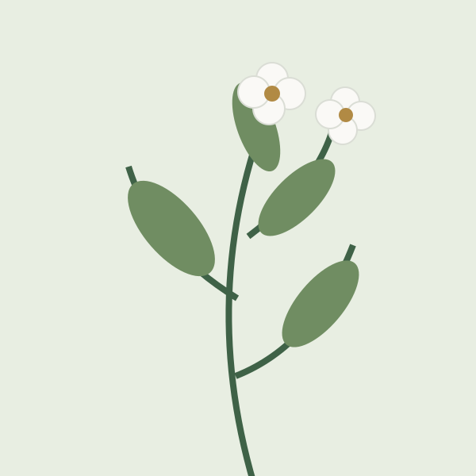

# A closer look at the branch

Keep an illustration and its explanation close while preserving the complete image and the details that identify it.

## Reading the illustration

Caption: The drawing records the arrangement of leaves and flowers along one branch. The open flowers face different directions, while the lower leaves show the changing angle of growth. Read the entire frame together with the observation rather than treating one flower as a separate specimen.

Credit: Field notebook

The illustration gives the reader a stable point of reference while the explanation develops. A branch is not a collection of unrelated marks: each leaf belongs to the same stem, and each flower is shown in relation to the others. Keeping the complete drawing visible helps the reader follow those relationships without needing to reconstruct a cropped view.

The caption carries details that should not be hidden or squeezed into a very narrow strip. It explains what the drawing records and how the reader should use it. The credit remains attached to the same image. Neither label becomes part of the following argument, and neither is inferred from the alternative text.

This explanation can sit beside the figure when both remain comfortable to read. In a narrow window the same material continues below the image in its original order. The layout changes, but the observation, caption, credit and source text do not.

## Return to the field

Record the next observation before comparing it with this illustration. A new section starts a new context and must remain outside the figure's composition.
