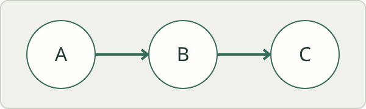

# Measured figures

This synthetic document exercises image dimensions, source order, and the space between an explanation and its figure.

## Explanation and diagram

Trace each connection from left to right. The complete diagram stays beside this explanation only when both are comfortable to read.

This authored paragraph follows the entire pair. It is not a caption derived from the image's alternative text.

## A boundary stays a boundary

This explanation belongs to this section, not to the figure in the next one.

## Standalone diagram

## Pending resource

An unavailable figure remains in source-order flow. Measuring candidates must not initiate another resource request.

## After the figures

All of this content remains editable. Narrow windows and large text should restore a complete stack without changing the Markdown.
