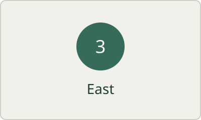
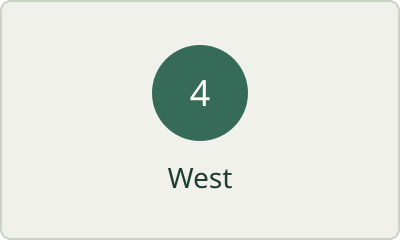

# Paired landscape figures

These synthetic figures have large source dimensions. Their pixel count should not be mistaken for a paragraph's preferred reading width.

Both figures stay complete, in source order. At comfortable widths they can share a row; narrow or short windows keep a vertical flow. Descriptions remain accessible alt text, not invented captions.

## Smaller originals

The next six figures use smaller intrinsic dimensions. They should not be enlarged merely to fill their assigned columns.

This paragraph follows all six figures and never becomes part of the gallery.
