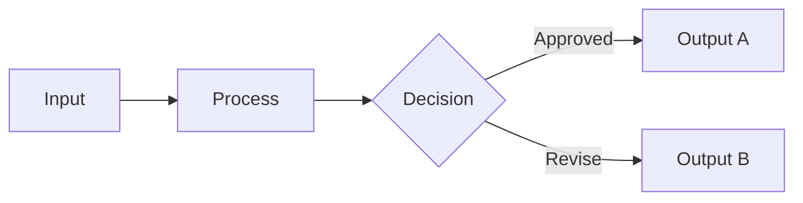
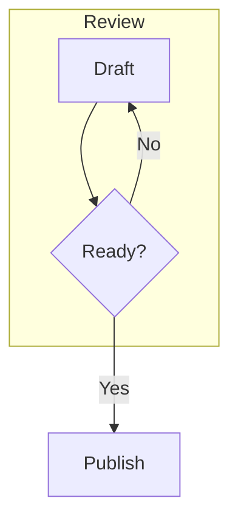

# Diagrams with evidence

An explicit flow retains its labels, direction and branches. The rendering is prepared from source; it is not a generated illustration.

## Review route



The input reaches the process before the decision. The two labeled arrows distinguish the possible outputs without relying on color.

## A cycle and a supporting group



The return arrow leads back to the draft. Publishing follows the explicitly labeled Yes branch.

## Recoverable source

```mermaid
flowchart LR
A[Unfinished label
```

An unfinished diagram remains editable source. It must not be shown as a misleading partial flowchart.
