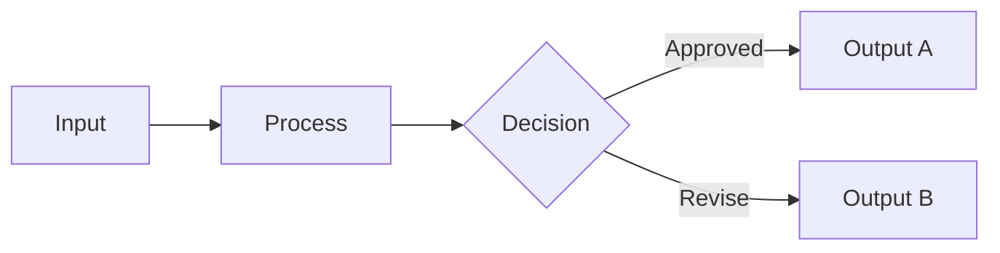

# A source-backed review

The explanation and its diagram describe the same route. Both remain readable when there is room to place them together.

## Input and decision

The input enters a processing stage before reaching a decision. The approved branch produces Output A; the revision branch produces Output B. Follow the arrowheads and their labels to distinguish the two outcomes. This explanation and the figure preserve the same authored sequence without relying on color.

## Following work

The next section stays below the complete explanation and figure. Editing the diagram exposes its original source; the surrounding document remains intact.
