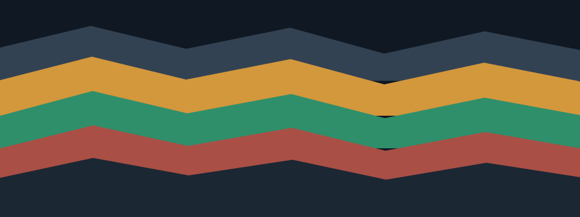

# Evidence can begin with code

An item does not need an invented paragraph title. Keep its authored code, heading or figure as the beginning of the branch, with supporting explanations below it.

## Source-led outline

- Archive
  - Coastal survey
    - Instrument record
      - ```rust
        let sample = 18.4;
        inspect(sample);
        ```
        - Interpretation
          - Review notes
            - ### Evidence heading
              - ```rust
                let accepted = true;
                record(accepted);
                ```
                - Code-led explanation preserves the measurement and the reasoning behind the decision. Keep the remaining questions with the original source, even when this branch is viewed in a narrow window.
              - 
                - Figure-led explanation describes the layers without substituting a generated title for the authored image description.
          - Return to the interpretation summary.
  - Return to the archive summary.

## Continue

The next section keeps its ordinary document position. The source still contains the same code blocks, heading, image and nested list items.
