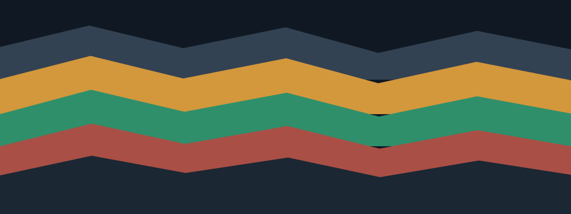

# A decade of notes, still legible at depth

Mineral keeps **important ideas**, *quiet context*, ~~discarded guesses~~, `inline code`, and a [local link](#tables-and-structure) in one editable surface. H₂O, café, العربية, 日本語, and 👩🏽‍💻 exercise real shaping.

> A block quote should remain calm, readable, and clearly distinct from the body without becoming a decorative card.

> [!NOTE]
> Alerts preserve a compact title and enough contrast for supporting information.

## Lists and tasks

- First-level item with a useful sentence.
  - Nested item that proves indentation and hierarchy.
    1. Ordered depth remains visible.
- [x] Verified with keyboard navigation
- [ ] Review at every required scale

## Code and long content

```rust
pub fn stable_anchor(node: NodeId, offset: f32) -> ScrollAnchor {
    ScrollAnchor { node, offset }
}
```

`0123456789_abcdefghijklmnopqrstuvwxyz_ABCDEFGHIJKLMNOPQRSTUVWXYZ` is deliberately wider than a narrow viewport to exercise local horizontal scrolling.

## Tables and structure

| Layer | Owner | Status | Notes |
| :--- | :--- | :---: | ---: |
| Source | `document-core` | ✓ | byte exact |
| Layout | `document-view` | ✓ | scale keyed |
| Shell | `markdown-app` | ✓ | native Wayland |

### Image lifecycle



The image has local dimensions, alt text, and no network dependency.

---

Footnotes remain part of the reading flow.[^source]

[^source]: This fixture is deterministic and checked into the repository.

<details><summary>Preserved HTML</summary>Unknown-but-safe source remains editable and serializable.</details>
